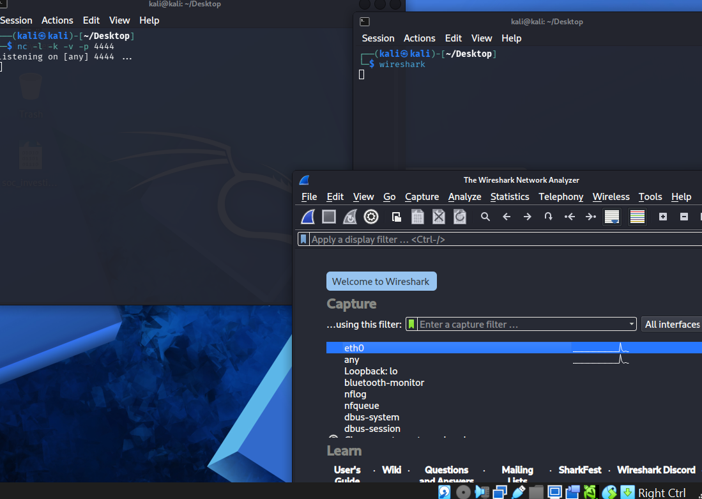

# Beaconing Traffic Detection Lab — Project Write-up

> **Project:** Beaconing Traffic Detection Lab
> 

> **Course:** MSci Cyber Security — Year 1, Lab Project
> 

> **Tools:** VirtualBox · Kali Linux · Ubuntu · Netcat · Wireshark · tshark · Python3 · Splunk Enterprise
> 

> 📖 **Read alongside:** [📚 Fundamentals] for theory
> 

---

# 🗺️ Lab Environment

## Network Architecture

The lab runs entirely on a single Windows host using VirtualBox. A host-only network (`192.168.102.x`) isolates all traffic within the machine — no traffic reaches the real home network at any point.

```jsx
Ubuntu  (192.168.102.3)  ← VICTIM
  └── beacon.sh         →  nc -w 1 connects to Kali every ~30 seconds

Kali Linux  (192.168.102.4)  ← C2 LISTENER + ANALYST
  ├── nc -l -k -v -p 4444    →  receives and logs periodic check-ins
  ├── Wireshark (eth0)       →  captures all TCP traffic on port 4444
  └── tshark + Python HTTP   →  converts pcap → csv → serves to Windows host

Windows Host  (192.168.102.1)  ← SIEM
  ├── Splunk Enterprise  →  ingests beacon.csv into beaconing_detection index
  └── SPL query          →  stdev() on time deltas flags ip_src with jitter < 5
```

> This lab simulates a **post-compromise C2 scenario** — Ubuntu plays the role of a compromised host periodically calling back to an attacker-controlled server on Kali. Detection is achieved entirely through time-series analysis of captured network traffic in Splunk.
> 

| Machine | Role | IP Address |
| --- | --- | --- |
| **Kali Linux VM** | C2 listener · Wireshark capture · tshark conversion · analyst workstation | `192.168.102.4` |
| **Ubuntu VM** | Victim · beacon script source | `192.168.102.3` |
| **Windows Host** | Splunk Enterprise · detection query | `192.168.102.1` |

---

# ⚔️ Phase 1 — Simulating C2 Beaconing

## Setting Up the Kali Listener

Before any beaconing traffic can be generated, the C2 listener must be running and ready to receive connections. The listener was started on Kali using:

```bash
nc -l -k -v -p 4444
```

| Flag | Purpose |
| --- | --- |
| `-l` | Listen mode — waits for incoming connections rather than initiating one |
| `-k` | Keep-alive — listener remains active after each connection closes, essential for detecting repeated check-ins |
| `-v` | Verbose — prints a log line each time a connection is made or dropped, visible in real time |
| `-p 4444` | Port 4444 — conventional C2 port in lab environments, easy to filter in Wireshark |

> Without `-k`, the listener would exit after the first beacon connection closed — capturing only one event and making time-delta analysis impossible.
> 

---

### Figure 1 — Kali Listener Running and Wireshark Capturing

*Kali terminal showing `nc -l -k -v -p 4444` with output `Listening on [any] 4444 ...` confirming the listener is active. Second terminal showing `wireshark` launched. Wireshark interface selector open with `eth0` highlighted — the interface carrying host-only network traffic between the two VMs.*



---

## Writing the Beaconing Script on Ubuntu

On Ubuntu, a bash script was created to simulate the victim's periodic callback behaviour:

```bash
nano beacon.sh
```

```bash
#!/bin/bash
while true
do
    nc -w 1 192.168.102.4 4444
    sleep 30
done
```

The script was then made executable and launched:

```bash
chmod +x beacon.sh
./beacon.sh
```

| Component | Purpose |
| --- | --- |
| `#!/bin/bash` | Shebang — tells the OS to use the bash interpreter at `/bin/bash` |
| `while true` | Infinite loop — runs until manually stopped with Ctrl+C |
| `nc -w 1` | Connect with 1-second timeout — forces the connection to close after 1 second so the loop continues |
| `192.168.102.4 4444` | Kali's IP and C2 port — the destination of each beacon |
| `sleep 30` | 30-second interval — the beacon period, creates the regular timing signature |

> The initial version used `nc 192.168.102.4 4444` with no timeout flag. After running it, Wireshark showed only one SYN packet — Netcat connected and waited indefinitely, so `sleep 30` was never reached and the loop stalled. The `-w 1` flag was added in a second edit to `beacon.sh` before the final capture was taken. The script shown above reflects the corrected version.
> 

**Old Script:**


---

### Figure 2 — Beaconing Script Written in nano on Ubuntu

*Ubuntu nano editor showing the completed `beacon.sh` script — `#!/bin/bash`, `while true`, `do`, `nc -w 1 192.168.102.4 4444`, `sleep 30`, `done` — the corrected version with the `-w 1` flag in place.*


---

### Figure 3 — Script Made Executable and Running

*Ubuntu terminal showing `chmod +x beacon.sh` granting execute permission, followed by `./beacon.sh` launching the script. Kali listener terminal in the background showing `connect to [192.168.102.4] from (UNKNOWN) [192.168.102.3]` — confirming the first beacon was received.*


---

# 📡 Phase 2 — Capturing Beaconing Traffic

## Wireshark Capture and Display Filter

With the listener running on Kali and Wireshark capturing on `eth0`, the display filter `tcp.port == 4444` was applied to isolate beaconing traffic from background noise.

```jsx
tcp.port == 4444
```

The initial beacon script (without `-w 1`) produced only a single SYN packet before stalling. After the flag was added and the script re-run, the characteristic TCP three-way handshake pattern became visible at ~30-second intervals:

| Packet | Direction | Flag | Meaning |
| --- | --- | --- | --- |
| 1 | Ubuntu → Kali | `[SYN]` | Beacon initiates connection — the check-in signal |
| 2 | Kali → Ubuntu | `[SYN, ACK]` | Listener acknowledges — connection accepted |
| 3 | Ubuntu → Kali | `[ACK]` | Connection established |
| 4 | Kali → Ubuntu | `[RST, ACK]` | Connection reset after `-w 1` timeout — expected behaviour |

The capture was left running for several minutes to accumulate enough beacon cycles for meaningful time-delta analysis in Splunk. The timestamp column confirmed intervals of approximately 30 seconds between successive SYN packets.

---

### Figure 4 — Beaconing Traffic Visible in Wireshark

*Wireshark display with `tcp.port == 4444` filter applied — showing TCP packets between `192.168.102.3` (Ubuntu) and `192.168.102.4` (Kali) with `[SYN]` and `[RST, ACK]` flags. Time column showing ~30-second intervals between successive connection attempts — the visual signature of periodic beaconing.*


---

### Figure 5 — Multiple Beacon Cycles Captured

*Wireshark packet list showing repeated SYN → RST,ACK cycles at timestamps approximately 30 seconds apart — packets 57, 58, 59 forming one handshake, then the same pattern repeating in subsequent rows. Time differences in the timestamp column confirm the regular interval.*


---

## Saving the Capture

After accumulating sufficient cycles, the Wireshark capture was stopped and saved:

`File → Save As → beacon.pcap` on the Kali Desktop.

This file is the raw evidence of the beaconing behaviour and the input to the next phase of the data pipeline.

---

# 🔧 Phase 3 — Data Pipeline: pcap → Splunk

## Converting pcap to CSV with tshark

Splunk cannot ingest raw pcap files — the capture had to be converted to a structured CSV format. tshark (Wireshark's command-line counterpart) was used to extract only the four fields needed for detection:

```bash
cd ~/Desktop
tshark -r beacon.pcap -T fields -e frame.time -e ip.src -e ip.dst -e tcp.dstport -E header=y -E separator=, > beacon.csv
```

| Flag / Argument | Purpose |
| --- | --- |
| `-r beacon.pcap` | Read from the saved capture file |
| `-T fields` | Output mode — extract specific named fields only |
| `-e frame.time` | Timestamp of each packet — basis for all time-delta calculations |
| `-e ip.src` | Source IP — used to group connections by victim host |
| `-e ip.dst` | Destination IP — identifies the C2 server being contacted |
| `-e tcp.dstport` | Destination port — used to filter for port 4444 traffic in Splunk |
| `-E header=y` | Include column headers — required for Splunk to create named fields |
| `-E separator=,` | Comma-separated output — standard CSV format |

The output was verified with `cat beacon.csv`, confirming the header row and data rows were correctly structured.

---

### Figure 6 — beacon.csv Content Verified

*Kali terminal showing `cat beacon.csv` output — header row `frame.time,ip.src,ip.dst,tcp.dstport` visible on line 1, followed by data rows including timestamps in ISO format and IP addresses `192.168.102.3` → `192.168.102.4` on port 4444. Some rows with empty fields are visible — these are non-TCP background packets that are filtered out later in Splunk.*


---

## Transferring the CSV via Python HTTP Server

With no shared folder or drag-and-drop configured between VMs, Python's built-in HTTP server was used to serve the file over the host-only network:

```bash
cd ~/Desktop
python3 -m http.server 8000
```

On the Windows host, a browser was opened and the file was downloaded by navigating to:

```jsx
http://192.168.102.4:8000
```

`beacon.csv` appeared in the directory listing and was clicked to download.

> The server must be started from the same directory as the file. Running it from `~` would expose the entire home directory over the network. Navigating to the Desktop first scopes it to only that folder.
> 


---

## Ingesting into Splunk

From the Windows host, Splunk was used to ingest the CSV via **Settings → Add Data → Upload**.

| Setting | Value | Reason |
| --- | --- | --- |
| Source Type | `csv` | Correctly identified automatically — tells Splunk to parse delimited fields |
| Field delimiter | Comma | Matches the `-E separator=,` used in tshark |
| Field names from line | `1` | Uses the header row to create named fields in Splunk |
| Index | `beaconing_detection` | Dedicated index — isolates this lab's data from previous lab data |

After ingestion, a raw event was expanded to verify field names. Splunk had silently converted all dots to underscores:

| CSV Field Name | Splunk Field Name |
| --- | --- |
| `frame.time` | `frame_time` |
| `ip.src` | `ip_src` |
| `ip.dst` | `ip_dst` |
| `tcp.dstport` | `tcp_dstport` |

This silent conversion is why the initial detection query returned no results — all field names had to be updated to use underscores before the query worked.

---

### Figure 7 — Splunk Ingestion Confirmed

*Splunk Add Data review screen showing source: `beacon.csv`, source type: `csv`, index: `beaconing_detection` — all three correct before clicking Submit.*


---

### Figure 8 — Field Names Verified by Expanding a Raw Event

*Splunk event expanded showing field names `frame_time`, `ip_src` (`192.168.102.4`), `ip_dst` (`192.168.102.3`), `tcp_dstport` (`56084`) — confirming Splunk's dot-to-underscore conversion. Note: this event is a Kali→Ubuntu RST,ACK packet (Kali resets the connection after the 1-second timeout), which is why `ip_src` shows Kali's IP. The detection query filters on `tcp_dstport=4444` to target the Ubuntu→Kali SYN packets, where `ip_src = 192.168.102.3`.*


---

# 🚨 Phase 4 — Detection Results

## The Detection Query

```jsx
index=beaconing_detection tcp_dstport=4444
| sort ip_src _time
| streamstats last(_time) as prev_time by ip_src
| eval time_gap = _time - prev_time
| stats stdev(time_gap) as jitter by ip_src
| where jitter < 5
```

| Line | Purpose |
| --- | --- |
| `index=beaconing_detection tcp_dstport=4444` | Filter to only port 4444 connections — removes empty rows and background traffic |
| `sort ip_src _time` | Chronological order per source IP — required before streamstats or deltas are meaningless |
| `streamstats last(_time) as prev_time by ip_src` | For each event, captures the timestamp of the previous connection from the same IP |
| `eval time_gap = _time - prev_time` | Calculates the gap in seconds between successive connections |
| `stats stdev(time_gap) as jitter by ip_src` | Measures consistency of gaps — low stdev = suspicious regularity |
| `where jitter < 5` | Flags IPs whose connection intervals are suspiciously consistent |

---

### Figure 9 — Detection Query Returning No Results (Before Field Name Fix)

*Splunk search showing the initial query with `ip.src` and `tcp.dstport` (dot notation) returning `0 events` — the silent failure caused by Splunk's dot-to-underscore conversion that was only resolved after expanding a raw event to verify actual field names.*


---

### Figure 10 — Detection Query Flagging Ubuntu

*Splunk search showing the corrected query with underscore field names returning `26 events`, Statistics tab selected. Results table showing a single row: `ip_src = 192.168.102.3` with `jitter = 0` — Ubuntu's IP flagged with a standard deviation of exactly zero, confirming perfectly regular beaconing intervals.*


---

## Detection Result

| Field | Value | Significance |
| --- | --- | --- |
| `ip_src` | `192.168.102.3` | Ubuntu — the victim machine performing the periodic callbacks |
| `jitter` | `0` | Standard deviation of 0 — connection intervals are mathematically identical, only possible with a fixed `sleep 30` and no randomness |

A jitter of **0** is the strongest possible beaconing signal. No legitimate application produces connection intervals with zero variance across multiple cycles. Combined with a non-standard port (4444) and repeated outbound TCP connections to the same destination, this result unambiguously indicates automated C2 behaviour.

## MITRE ATT&CK Mapping

| ID | Technique | Tactic | What Happened |
| --- | --- | --- | --- |
| **T1071** | Application Layer Protocol | Command and Control (TA0011) | Ubuntu used standard TCP to periodically check in with the Kali C2 listener on port 4444 |
| **T1571** | Non-Standard Port | Command and Control (TA0011) | Port 4444 is non-standard and not associated with any legitimate service — its use is itself a weak indicator of C2 activity |

---

# ✅ Summary

## Key Findings

| Finding | Detail |
| --- | --- |
| 🔴 Role confusion — both commands run on Kali | First attempt had both the listener and beacon script on Kali — connection refused immediately. Required two separate machines with clearly defined roles. |
| 🔴 `nc` without `-w 1` blocked the loop | Initial script used `nc 192.168.102.4 4444` with no timeout. Netcat connected and waited indefinitely — `sleep 30` never ran, the loop stalled after one beacon, and no repeating pattern appeared in Wireshark. Fixed by editing `beacon.sh` to add `-w 1` before re-running. |
| 🔴 Splunk field names silently converted | Dots in CSV headers (`ip.src`) became underscores in Splunk (`ip_src`). Initial query returned 0 events with no error. Fixed after verifying field names by expanding a raw event. |
| ✅ Beaconing captured successfully | Multiple beacon cycles visible in Wireshark at ~30-second intervals, `[SYN]` and `[RST, ACK]` pattern confirmed on port 4444 |
| ✅ Data pipeline working end-to-end | beacon.pcap → tshark CSV → Python HTTP server → Splunk ingestion — all four stages completed successfully |
| ✅ Detection query flagged Ubuntu correctly | `ip_src = 192.168.102.3` returned with `jitter = 0` — victim machine positively identified via time-delta analysis |
| ✅ `stdev()` confirmed as correct detection function | Standard deviation of 0 is a near-perfect beaconing signal — distinct from legitimate traffic which always has non-zero variance |

## Complete Detection Pipeline — Validated

```jsx
Ubuntu (192.168.102.3) — beacon.sh
  nc -w 1 192.168.102.4 4444  every 30 seconds
         ↓
Kali (192.168.102.4) — nc -l -k -v -p 4444
  receives periodic connections
         ↓
Wireshark (eth0, tcp.port == 4444)
  captures SYN packets at ~30s intervals
         ↓
tshark -r beacon.pcap → beacon.csv
  frame.time | ip.src | ip.dst | tcp.dstport
         ↓
python3 -m http.server 8000
  serves beacon.csv to Windows host browser
         ↓
Splunk — index: beaconing_detection
  ingests CSV · field names: ip_src, tcp_dstport, frame_time
         ↓
SPL detection query
  sort → streamstats → eval time_gap → stats stdev() → where jitter < 5
         ↓
Result: ip_src=192.168.102.3  jitter=0 ✅
```

- 🔒 Extensions & Production Improvements
    
    **Detection Improvements**
    
    - **Jitter-aware threshold** — set `where jitter < 10` instead of `< 5` to catch beaconing with randomised sleep intervals (e.g. `$((30 + RANDOM % 10))`)
    - **Minimum connection count** — add `count(time_gap) > 5` to the `where` clause to avoid flagging sources with only 2–3 connections where stdev could be misleadingly low
    - **C2 domain tracking** — extend detection to flag repeated DNS lookups to the same external domain at regular intervals (domain-fronting beaconing)
    - **Alert on detection** — save the query as a Splunk scheduled alert with throttling, firing when any result has `jitter < 5`
    
    **Simulation Improvements**
    
    - **Add jitter to beacon script** — use `sleep $((30 + RANDOM % 10))` instead of `sleep 30` to test whether detection still works with non-zero variance
    - **Longer capture window** — accumulate 20+ cycles before converting to CSV for more statistically robust stdev calculations
    - **HTTPS/TLS beaconing** — replace bare TCP Netcat with an encrypted channel to simulate modern C2 tools that use HTTPS to blend into legitimate web traffic
    
    **Production Improvements**
    
    - **Zeek/Suricata as data source** — replace Wireshark+tshark with a live network sensor that produces continuous logs, enabling real-time detection rather than batch analysis
    - **Dedicated alert index** — send query results to a `beaconing_alerts` index for triage by SOC analysts
    - **Baseline legitimate polling** — allowlist known monitoring tools (e.g. CloudWatch agents, uptime checkers) that have regular low-jitter traffic patterns

---
