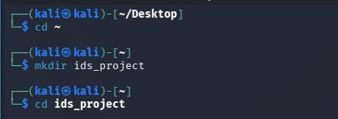

# Custom Log-Based IDS Script — Project Write-up

> **Project:** Custom Log-Based Intrusion Detection Script
> 

> **Course:** MSci Cyber Security — Year 1, Lab Project
> 

> **Tools:** VirtualBox · Kali Linux · Python3 · Hydra · Splunk Enterprise · journalctl
> 

> 📖 **Read alongside:** [📚 Fundamentals] for theory 
> 

---

# 🗺️ Lab Environment

## Network Architecture

The lab runs entirely on a single Windows host using VirtualBox. A host-only network (`192.168.102.x`) isolates all traffic within the machine — no traffic reaches the real home network at any point.

```
Kali Linux  (192.168.102.4)  ← ATTACKER + DETECTOR
  ├── Hydra        →  generates SSH brute force attempts against localhost
  ├── SSH daemon   →  receives login attempts, writes failures to journald
  ├── journalctl   →  exports SSH logs to ids_project/auth.log
  └── ids.py       →  parses logs, detects brute force, forwards JSON alerts

Windows Host  (192.168.102.1)  ← SIEM
  ├── Splunk Enterprise  →  receives alerts via HTTP Event Collector (port 8088)
  └── HEC Token         →  authenticates the script POST requests

Firewall Rule (Windows Defender)
  └── Inbound TCP 8088 — scoped to 192.168.102.4 only (defence in depth)
```

> This lab is unique in that Kali plays **both roles simultaneously** — it generates the brute force traffic AND runs the detector.
> 

| Machine | Role | IP Address |
| --- | --- | --- |
| **Windows Host** | Runs Splunk Enterprise · HEC endpoint on port 8088 | `192.168.102.1` |
| **Kali Linux VM** | Runs Hydra · [ids.py](http://ids.py) · SSH daemon | `192.168.102.4` |
| **HEC Port** | Splunk alert ingestion endpoint | `8088/TCP` |

---

### Figure 1 — Working Directory Created and SSH Service Started

*Terminal showing `cd ~`, `mkdir ids_project`, `cd ids_project` — confirming the project folder was created in the home directory.*



`*pwd` confirming `/home/kali/ids_project` as the working directory — `sudo systemctl start ssh` launching the SSH daemon so Hydra has a target to attack.*


### Figure 2 — SSH Service Confirmed Active

`*sudo systemctl status ssh` showing `active (running)` — the SSH daemon is listening on port 22, ready to receive and log Hydra's brute force attempts.*


---

# ⚔️ Phase 1 — Generating Brute Force Traffic

## Hydra Command

```bash
hydra -l kali -P /usr/share/wordlists/rockyou.txt -t 4 127.0.0.1 ssh
```

| Flag | Value | Purpose |
| --- | --- | --- |
| `-l` | `kali` | Single target username |
| `-P` | `rockyou.txt` | 14M+ real-world password wordlist |
| `-t 4` | — | 4 parallel threads — prevents SSH connection drops at default 16 |
| `127.0.0.1` | — | [Localhost](http://Localhost) — attacks Kali's own SSH service |
| `ssh` | — | Target protocol |

---

### Figure 3 — Hydra Running Against [Localhost](http://Localhost)

*Hydra v9.6 initiating the brute force attack against `ssh://127.0.0.1:22/` — the warning about parallel task limits prompted the use of `-t 4` to prevent connection drops.*


---

## Discovering the Kali Log Format

Running `grep "Failed password" /var/log/auth.log` returned:

```
grep: /var/log/auth.log: No such file or directory
```

Kali uses `systemd-journald` — `/var/log/auth.log` does not exist. SSH failures are stored in the binary journal.

```bash
sudo journalctl -u ssh
```

Two failure line types confirmed:

```
Jun 16 18:06:07 kali sshd-session[478538]: pam_unix(sshd:auth): authentication failure; rhost=127.0.0.1 user=kali
Jun 16 18:06:07 kali unix_chkpwd[478562]: password check failed for user (kali)
```

| Line Type | Contains IP? | IP Format |
| --- | --- | --- |
| `unix_chkpwd` — password check failed | ❌ No | — |
| `sshd-session` — authentication failure | ✅ Yes | `rhost=127.0.0.1` |

Only `sshd-session` lines contain an IP, and it appears as `rhost=` — not `from` as in standard Ubuntu auth.log. This directly determined the regex pattern.

---

### Figure 4 — Failed Login Entries in journalctl

`*grep` against `/var/log/auth.log` returning "No such file or directory" — confirming Kali does not write to the traditional auth.log path.*


`*ls /var/log/` confirming the absence of auth.log — the `journal/` directory is visible, indicating systemd-journald is the active logging system.*


`*sudo journalctl -u ssh` showing brute force failures including `authentication failure; rhost=127.0.0.1` — confirming both the log location and the `rhost=` IP format used in the regex.*


---

## Exporting to a Flat File

```bash
sudo journalctl -u ssh > /home/kali/ids_project/auth.log
ls -lh /home/kali/ids_project/
```

Result: `-rw-rw-r-- 1 kali kali 29K Jun 16 18:36 auth.log` — 32K confirms real content.

---

### Figure 5 — auth.log Exported Successfully

`*ls -lh` showing `32K` for auth.log — confirming the journald export wrote real content to the flat file ready for Python to parse.*


### Figure 6 — Log Format Inspection

`*grep` filtering the exported auth.log — both line types visible side by side, confirming only `sshd-session` lines carry an IP address and that it appears as `rhost=127.0.0.1`.*


---

# 🐍 Phase 2 — Building the Detection Script

## Complete Script

```python
import re
import json
import requests
from datetime import datetime

LOG_FILE   = "/home/kali/ids_project/auth.log"
SPLUNK_URL = "http://192.168.102.1:8088/services/collector/event"
SPLUNK_TOKEN = "b3ca7a1d-e274-43df-98d1-6a9a29ca864e"
THRESHOLD  = 10

def parse_log():
    failed_attempts = {}
    alerted_ips     = set()

    with open(LOG_FILE, 'r') as f:
        for line in f:
            match = re.search(r'rhost=(\d+\.\d+\.\d+\.\d+)', line)
            if match:
                ip = match.group(1)
                failed_attempts[ip] = failed_attempts.get(ip, 0) + 1

                if failed_attempts[ip] >= THRESHOLD and ip not in alerted_ips:
                    alerted_ips.add(ip)
                    print(f"ALERT! Brute Force detected from {ip} → {failed_attempts[ip]} attempts")

                    alert = {
                        "timestamp":       datetime.now().strftime("%Y-%m-%dT%H:%M:%S"),
                        "alert_type":      "brute_force",
                        "source_ip":       ip,
                        "failed_attempts": failed_attempts[ip],
                        "severity":        "HIGH"
                    }

                    headers = {"Authorization": f"Splunk {SPLUNK_TOKEN}"}
                    payload = {"event": alert}
                    requests.post(SPLUNK_URL, headers=headers, json=payload)

if __name__ == "__main__":
    parse_log()
```

## Key Design Decisions

| Decision | Reason |
| --- | --- |
| `rhost=` regex, not `from` | Kali's journald format — `from` pattern matches nothing on this system |
| `group(1)` not `group(0)` | `group(0)` returns `rhost=127.0.0.1` — `group(1)` returns the IP only |
| `.get(ip, 0) + 1` | First-occurrence safety — returns 0 if IP not yet in dictionary |
| `>=` not `>` | `>` silently misses exactly 10 attempts — boundary condition bug |
| `alerted_ips` set | Fires once per IP — eliminates alert fatigue from duplicate events |
| `print()` before `requests.post()` | Terminal confirmation even if HEC connection fails |
| `if __name__ == "__main__":` | Prevents auto-execution if imported by another module |

---

### Figure 7 — Script Development in nano

`*touch ids.py` creating the script file, followed by `nano ids.py` opening the editor — the starting point for writing the detection script.*


*The three library imports and `from datetime import datetime` entered at the top of the file — establishing the tools the script will use.*


`*pip install requests` failing with `externally-managed-environment` — Kali protects its system Python from pip; the fix is `sudo apt install python3-requests`.*


`*sudo apt install python3-requests` confirming the library is already at its newest version — no installation needed.*


*Configuration variables added — `LOG_FILE`, `SPLUNK_URL`, `SPLUNK_TOKEN` (placeholder at this stage), and `THRESHOLD = 10`.*


*The alert dictionary taking shape inside the threshold block — `timestamp`, `alert_type`, `source_ip`, `failed_attempts`, and `severity` fields defined.*


`*if __name__ == "__main__": parse_log()` added at the bottom — the script's entry point, preventing auto-execution if imported.*


*The completed script in nano showing all components — imports, config vars, `parse_log()` function, regex, threshold condition with `alerted_ips`, JSON alert dict, and `requests.post()`.*


*Mild severity level added to the script.*


---

# 🔌 Phase 3 — Configuring Splunk HEC

## Global Settings

| Setting | Value | Reason |
| --- | --- | --- |
| All Tokens | Enabled | Activates HEC globally |
| Enable SSL | ❌ Disabled | Script uses `http://` — SSL mismatch would refuse all connections |
| HTTP Port | `8088` | Default HEC port — matches SPLUNK_URL |

## Token Created

Token name: `kali_ids_token`

Token value: `b3ca7a1d-e274-43df-98d1-6a9a29ca864e`

---

### Figure 8 — Splunk HEC Configuration

*Splunk HEC landing page showing 0 tokens and the `New Token` button — the starting point before any HEC tokens exist.*


*HEC Global Settings with SSL disabled and port 8088 confirmed — these settings must be saved before any token will work.*


`*Token has been created successfully` — token value `b3ca7a1d-e274-43df-98d1-6a9a29ca864e` generated and ready to be copied into the script.*


*Script updated in nano with the real HEC token and Windows host IP `192.168.102.1` replacing the placeholder values.*


---

## Windows Firewall Rule

| Setting | Value |
| --- | --- |
| Rule name | `Splunk HEC` |
| Protocol | TCP |
| Port | `8088` |
| Action | Allow |
| Scope — Remote IP | `192.168.102.4` (Kali only) |

**Defence in depth:** Restricting the rule to Kali's IP in the Scope tab means only the IDS script can reach port 8088. Any other machine attempting to POST to Splunk HEC is blocked even with the rule present.

---

### Figure 9 — Firewall Rule Active

*Windows Firewall Splunk HEC rule — TCP port 8088 set to Allow, confirming the port is open for inbound connections from Kali.*


*Scope tab showing Remote IP restricted to `192.168.102.4` — only Kali's IP is permitted, applying the principle of least privilege to the firewall rule.*


---

# 🚨 Phase 4 — Detection Results

## Before Deduplication — Alert Fatigue Demonstrated

An early run without the `alerted_ips` set showed the problem the set solves — every line above the threshold triggered a new alert for the same IP, flooding the output.

`*python3 ids.py` output firing a new alert for every attempt above the threshold — counts climbing from 10 through to 32 for the same IP, demonstrating alert fatigue before the `alerted_ips` set was added.*


## Terminal Output — Single Clean Alert

After adding deduplication via the `alerted_ips` set:

```
ALERT! Brute Force detected from 127.0.0.1 → 10 attempts
```

One alert. No duplicates. No connection error. Every link in the pipeline confirmed working.

---

### Figure 10 — Single Clean Alert in Terminal

`*python3 ids.py` producing a single `ALERT! Brute Force detected from 127.0.0.1 → 10 attempts` — one clean line with no errors, confirming the full pipeline works end-to-end.*


---

## Splunk Verification

```
index=main alert_type="brute_force"
```

**24 events returned** — including earlier test runs and the final validated alert.

Most recent event (validated run):

```json
{
  "alert_type":      "brute_force",
  "failed_attempts": 10,
  "severity":        "HIGH",
  "source_ip":       "127.0.0.1",
  "timestamp":       "2026-06-17T19:10:52"
}
```

| Field | Value | Confirms |
| --- | --- | --- |
| `alert_type` | `brute_force` | JSON structure indexed correctly |
| `failed_attempts` | `10` | Threshold fired at exactly the right count |
| `severity` | `HIGH` | Severity field working |
| `source_ip` | `127.0.0.1` | Regex extracted correct IP |
| `timestamp` | `2026-06-17T19:10:52` | datetime module working |
| `source` | `http:kali_ids_token` | HEC token authenticated — Splunk metadata |
| `host` | `192.168.102.1:8088` | Correct Windows host targeted — Splunk metadata |

---

### Figure 11 — Alerts Indexed in Splunk

*Splunk search `index=main alert_type="brute_force"` returning 24 events — the expanded event shows all five alert fields correctly indexed plus HEC metadata (`source` and `host`), confirming the full pipeline.*


---

## MITRE ATT&CK Mapping

| ID | Technique | Tactic | What Happened |
| --- | --- | --- | --- |
| **T1110.001** | Brute Force: Password Guessing | Credential Access (TA0006) | Hydra made repeated SSH login attempts using rockyou.txt wordlist |

---

# ✅ Summary

## Key Findings

| Finding | Detail |
| --- | --- |
| 🔴 journald used, not auth.log | Kali's logging system required `journalctl -u ssh` export — traditional path did not exist |
| 🔴 `rhost=` format, not `from` | Regex had to match Kali's actual log format — standard tutorials would have produced zero matches |
| ✅ Threshold detection working | Alert fired at exactly 10 attempts — `>=` operator confirmed correct |
| ✅ Deduplication working | One alert per IP — alert fatigue eliminated via `alerted_ips` set |
| ✅ JSON structure indexed | All five alert fields individually queryable in Splunk |
| ✅ HEC pipeline end-to-end | Kali → HTTP POST → Windows host port 8088 → Splunk index ✅ |
| ✅ Defence in depth applied | Firewall rule scoped to Kali's IP only — principle of least privilege followed |

## Complete IDS Pipeline — Validated

```
Hydra brute force → localhost SSH
         ↓
systemd-journald (SSH failure events)
         ↓
journalctl -u ssh → ids_project/auth.log
         ↓
ids.py
  regex  → rhost=(\d+\.\d+\.\d+\.\d+)
  count  → failed_attempts[ip] = .get(ip, 0) + 1
  check  → >= THRESHOLD and ip not in alerted_ips
  alert  → JSON dict → requests.post()
         ↓
Splunk HEC — port 8088 — 192.168.102.1
         ↓
index=main alert_type="brute_force" ✅
```

- 🔒 Extensions & Production Improvements
    
    **Script Extensions**
    
    - **Real-time monitoring** — modify to continuously tail the log file rather than reading once and exiting
    - **Multiple log sources** — extend regex to catch failures from FTP, RDP, web login forms
    
    **Production Improvements**
    
    - **Direct journald parsing** — use Python's `systemd` library to read the journal in real time, removing the manual export step entirely
    - **HTTPS for HEC** — configure SSL on the HEC endpoint and update URL to `https://` — prevents token interception
    - **Dedicated Splunk index** — create `ids_alerts` index and lock the HEC token to it — keeps IDS events separate from other ingested data
    - **fail2ban alongside the script** — [ids.py](http://ids.py) detects and alerts; fail2ban blocks. Detection + automated response covers both visibility and containment
    - **CLI threshold argument** — `--threshold` flag lets sensitivity be adjusted without editing the script

---
