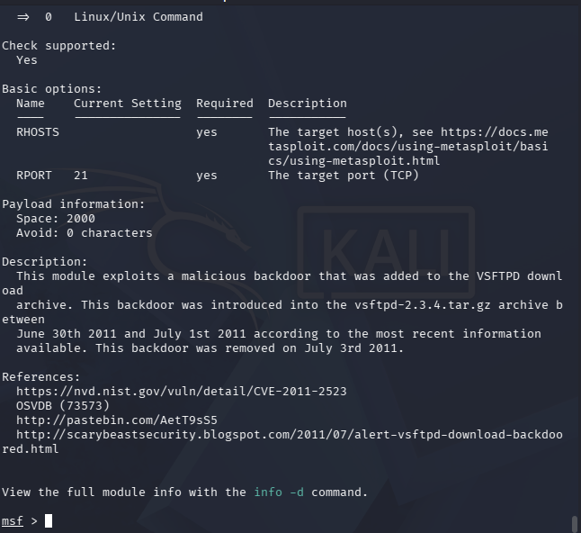

# 📝 Exploitation Visibility Analysis — Project Write-up

> **Project:** Exploitation Visibility Analysis — Metasploit Exploitation & SIEM Detection Gap Analysis
> 

> **Course:** MSci Cyber Security — Year 1, Lab Project
> 

> **Tools:** VirtualBox, Kali Linux, Ubuntu, Metasploit Framework, Splunk Enterprise
> 

> 📖 **Read alongside:** Fundamentals for theory 
> 

---

# 🗺️ Lab Environment

## Network Architecture

The lab runs entirely on VirtualBox. Ubuntu required a **second network adapter** partway through this project — the existing host-only network (192.168.102.x) has no route to the internet, which blocked compiling the exploit target from source. A NAT adapter was added alongside it rather than replacing it, so both networks stay live simultaneously.

| Machine | Role | IP Address |
| --- | --- | --- |
| Kali Linux | Attacker — runs Metasploit | 192.168.102.4 |
| Ubuntu Server 26.04 | Target — hand-built vulnerable vsftpd 2.3.4 | 192.168.102.3 |
| Splunk (indexer) | Log ingestion & detection | 192.168.102.1:9997 |

```jsx
Kali (192.168.102.4)
  └── exploit/unix/ftp/vsftpd_234_backdoor → triggers over port 21

Ubuntu (192.168.102.3) — dual-homed
  ├── enp0s3 (host-only) → Kali's subnet, exploit traffic
  └── enp0s8 (NAT) → internet, used only for build (apt/git)

      backdoor opens raw root shell on port 6200
            ↓
      auth.log / vsftpd.log / syslog
            ↓
      Splunk Universal Forwarder (inputs.conf → outputs.conf)
            ↓
      Splunk index=main — collected? forwarded? detected?
```

> ⚠️ Unlike previous labs, the target here is a **deliberately compiled vulnerable service**, not a stock package. The vulnerability (CVE-2011-2523) was removed from the official vsftpd archive within 3 days of being planted in 2011 — a modern `apt install` cannot reproduce it.
> 

---

# 🎯 Target & Exploit Selection

Three Metasploit modules were evaluated before choosing one: Samba (`setinfopolicy_heap`, `chain_reply`), ProFTPD (`sreplace`, `telnet_iac`), and vsftpd (`vsftpd_234_backdoor`).

| Candidate | Vulnerability Class | Verdict |
| --- | --- | --- |
| Samba | Heap/memory corruption | Ruled out — target list tied to 2010–2012 Ubuntu/Debian/CentOS builds, a 15-year offset mismatch against Ubuntu 26.04 |
| ProFTPD | Buffer overflow | Ruled out — same version-matching problem |
| vsftpd 2.3.4 | Planted backdoor (not memory corruption) | Selected — Rank: Excellent, Check: Yes, single generic target, version-agnostic |

> 📸 **Figure 1** — msfconsole `info` output for `vsftpd_234_backdoor`: Rank Excellent, Check: Yes, single "Linux/Unix Command" target, CVE-2011-2523 referenced in the description and References section.
> 



---

# 🔧 Building the Vulnerable Target From Source

The backdoored vsftpd 2.3.4 source was cloned from a GitHub mirror (the original archive-planted backdoor was pulled within days in 2011) and compiled by hand on Ubuntu 26.04 — confirmed via:

```bash
cat /etc/os-release
# PRETTY_NAME="Ubuntu 26.04 LTS" (Resolute Raccoon)
```

> 📸 **Figure 2** — `/etc/os-release` output confirming the target is running current Ubuntu 26.04 LTS.
> 


## Network Blocker: Host-Only Has No Internet

`apt update` failed immediately with `Temporary failure resolving 'archive.ubuntu.com'` on every mirror — a DNS resolution failure across the board, pointing at no route out at all rather than a flaky repo.

> 📸 **Figure 3** — `sudo apt update` failing with repeated `Temporary failure resolving` errors on the host-only-only Ubuntu VM.
> 


**Fix:** added a second network adapter (NAT) in VirtualBox, alongside the existing host-only one — rather than switching the existing adapter back and forth, which would have severed Kali's route to Ubuntu.

> 📸 **Figure 4** — VirtualBox Adapter 2 settings: Enabled, Attached to NAT, Virtual Cable Connected.
> 


Confirmed both networks live simultaneously via the routing table:

```bash
ip route
# default via 10.0.3.2 dev enp0s8       ← NAT: general internet traffic
# 192.168.102.0/24 dev enp0s3            ← host-only: Kali's subnet, untouched
```

> 📸 **Figure 5** — `ip route` output showing both the NAT default route and the host-only subnet route coexisting.
> 


```bash
sudo apt update   # now succeeds — real repo data pulled through
```

> 📸 **Figure 6** — `sudo apt update` completing successfully after the NAT adapter fix, pulling real package data.
> 


## Compiling the Backdoored Source

```bash
sudo apt install -y build-essential libpam0g-dev git
git clone https://github.com/DoctorKisow/vsftpd-2.3.4.git
cd vsftpd-2.3.4 && chmod +x vsf_findlibs.sh
```

> 📸 **Figure 7** — `git clone` of the backdoored vsftpd 2.3.4 source completing successfully (182 objects received).
> 


Two Makefile edits were required, both compensating for a 15-year gap between this code and the modern build toolchain:

```jsx
LIBS = `./vsf_findlibs.sh` -lcrypt -lpam
CFLAGS = -O2 -Wall -W -Wshadow -Wno-implicit-function-declaration #-pedantic -Werror -Wconversion
```

| Flag added | Why |
| --- | --- |
| -lpam | vsftpd needs PAM for authentication; the 2011 Makefile never linked it |
| -Wno-implicit-function-declaration | GCC 14+ turned a 2011-era warning into a hard build error by default; this restores the older, permissive behaviour this code was written against |

```bash
make   # succeeds — one benign enum-conversion warning only
```

> 📸 **Figure 8** — `make` completing successfully across all source files, ending in a working vsftpd binary (one harmless -Wenum-conversion warning, no errors).
> 


---

# ⚙️ Completing the Manual Install

`sudo make install` surfaced — one at a time — every setup step `apt install vsftpd` normally performs invisibly:

| Symptom | Root Cause | Fix |
| --- | --- | --- |
| cannot locate user specified in 'ftp_username':ftp | No system ftp user existed | useradd --system --shell /usr/sbin/nologin --no-create-home ftp |
| Total silence — no error, no log output at all | No /etc/pam.d/vsftpd service file for PAM to reference | Created it, referencing common-auth/common-account/common-session |
| "Child died" immediately on connection | Missing /usr/share/empty chroot security directory | mkdir /usr/share/empty; chown root:root; chmod 000 |
| /etc/vsftpd.conf doesn't exist | This Makefile's install: target never copies a config at all | cp vsftpd.conf /etc/vsftpd.conf from the cloned repo |

> 📸 **Figure 9** — the ftp_username error at first startup attempt: "vsftpd: cannot locate user specified in 'ftp_username':ftp".
> 


> 📸 **Figure 10** — /usr/share/empty created and confirmed with d--------- permissions (root-owned, totally unwritable — that's the entire point of a chroot jail directory).
> 


Once all four gaps were closed, the service bound successfully:

```bash
sudo ss -tlnp | grep :21
# LISTEN 0  32  0.0.0.0:21  0.0.0.0:*  users:(("vsftpd",pid=4334,fd=3))
```

> 📸 **Figure 11** — ss -tlnp confirming a single, clean vsftpd process bound and listening on port 21.
> 


Reachability confirmed from Kali before touching Metasploit at all:

```bash
nc -zv 192.168.102.3 21
# (UNKNOWN) [192.168.102.3] 21 (ftp) open
```

> 📸 **Figure 12** — nc -zv from Kali confirming port 21 open and reachable across the host-only network.
> 


---

# 💥 Exploitation

## Module & Payload Selection

```
use exploit/unix/ftp/vsftpd_234_backdoor
set RHOSTS 192.168.102.3
```

Three payload attempts were needed before landing on a stable one:

| Attempt | Payload | Result |
| --- | --- | --- |
| 1 | cmd/linux/http/x86/meterpreter_reverse_tcp (module default) | Wrong architecture — 32-bit stager, Ubuntu 26.04 has no i386 support at all |
| 2 | cmd/unix/interact (the "textbook" pairing) | Rejected outright by this Metasploit build — documentation had drifted from the actual framework version |
| 3 | cmd/linux/http/x64/meterpreter_reverse_tcp (correct architecture) | Session opened, then died instantly every time — fetch-based process wasn't detached from the closing parent shell |
| Final | cmd/unix/reverse_bash | Self-contained — uses bash's own /dev/tcp feature, no second process to depend on |

> 📸 **Figure 13** — dpkg --print-foreign-architectures returning empty, confirming no 32-bit support, alongside the 64-bit payload list found via grep x64 show payloads.
> 


> 📸 **Figure 14** — set PAYLOAD cmd/unix/interact rejected: "The value specified for PAYLOAD is not valid" — despite the payload existing in the framework.
> 


## The Backdoor's Race Condition

Repeated exploit attempts fell into a predictable failure loop — "Cooldown?" on the first try, then "already open... not a fresh shell... already exploited?" on every retry after. The module's own source code explains why: it always checks port 6200 first, and reuses whatever it finds there rather than re-triggering — but the real backdoor accepts only one connection, ever, per trigger.

> 📸 **Figure 15** — the full failure cycle in one screenshot: "port already open... Backdoor has been spawned!... does not appear to be a fresh shell. Already exploited?... Could not connect to backdoor."
> 


**Fix:** a disciplined full kill-and-restart cycle before every fresh attempt — confirming both ports 21 and 6200 were empty, not just 21:

```bash
sudo pkill -9 vsftpd
sudo ss -tlnp | grep -E ':21|:6200'   # must be empty
sudo /usr/local/sbin/vsftpd
```

## Root Access Achieved

```bash
whoami   # root
id       # uid=0(root) gid=0(root) groups=0(root)
```

> 📸 **Figure 16** — confirmed root shell via whoami and id — uid=0(root), no privilege escalation required at any point.
> 


> ✅ **Result:** full root compromise via **T1210 — Exploitation of Remote Services**. No user execution on the target was required at any point — only pre-existing knowledge of the target's IP and the vulnerable service running on port 21.
> 

---

# 🔍 Raw Log Visibility Findings (Layer 1)

Every plausible OS-level log source on Ubuntu was checked against the exploit's real timestamp.

| Log Source | Finding |
| --- | --- |
| auth.log | Zero trace, at any timestamp. The backdoor's code path never touches the real login mechanism. |
| vsftpd.log | Logs bare CONNECT: Client "IP" — no username, no command, no way to distinguish the exploit from a normal client. Also stopped logging entirely on the rebuilt instance. |
| syslog | No mention of vsftpd at all — not even an incidental crash message. |
| Port 6200 (the actual command channel) | No OS-level trace found anywhere. |

> 📸 **Figure 17** — grep "2026-07-09" /var/log/auth.log returning completely empty — zero trace of the exploit at the actual authentication log, on the actual exploit date.
> 


> 📸 **Figure 18** — vsftpd.log contents: a series of bare CONNECT: Client "192.168.102.4" lines — partial visibility, but no resolution to identify the exploit specifically.
> 


> ⚠️ Early greps for "vsftpd"/"ftp" in auth.log initially looked like hits — but every match was a coincidental folder-name (/home/s3rvic/vsftpd-2.3.4) or an unrelated useradd entry from days earlier. Checking the actual timestamp on each match (not just the 09/07 exploit date) exposed them as false positives.
> 

---

# 📡 Splunk Collection & Detection Findings (Layers 2 & 3)

## Finding 1 — A Genuine Configuration Gap

inputs.conf monitors auth.log and syslog — but has no stanza at all for vsftpd.log. Real data sitting on disk would never reach Splunk, purely because nobody added the monitor.

> 📸 **Figure 19** — inputs.conf contents showing monitor stanzas for auth.log and syslog only — vsftpd.log entirely absent.
> 


## Finding 2 — A Timezone Trap

A correctly-structured SPL query still returned zero results:

```
index=main (sourcetype=linux_secure OR sourcetype=syslog) earliest="07/09/2026:07:50:00" latest="07/09/2026:08:00:00"
```

> 📸 **Figure 20** — the above query returning "0 events" in Splunk, despite the exploit having occurred.
> 


Raw Ubuntu timestamps are UTC; Metasploit's own reported timestamp used a different offset (-0400) — the typed window silently missed the real data. Removing time as a variable entirely (index=* host=ubuntu-target, all time) was the only way to separate a query problem from a data problem.

## Finding 3 — The Real Root Cause: A Silently Stalled Forwarder

Even a full 24-hour, unfiltered search told a bigger story than expected:

> 📸 **Figure 21** — broad index=* host=ubuntu-target search: 191,211 total events exist for this host — but the timeline shows nothing more recent than July 8th, a full day before the actual exploit.
> 


The forwarder process itself showed as alive — but its own internal log had gone silent, with no crash and no visible error:

> 📸 **Figure 22** — splunkd.log tail showing a steady "Found currently active indexer" heartbeat every 10–20 seconds, ending abruptly and never resuming.
> 


The actual mechanism was found in the forwarder's own error log — a stalled TCP output, not a crashed process:

> 📸 **Figure 23** — splunkd.log error: "The TCP output processor has paused the data flow... blocked_seconds=100... probably not accepting data."
> 


> 📸 **Figure 24** — journalctl/process check confirming the forwarder was technically running the whole time — "running" and "actively forwarding" are not the same claim.
> 


> ⚠️ **This is the most significant finding of the whole investigation.** By the time the actual exploit happened, this host may have had zero live log delivery to Splunk at all — meaning Layer 3 (detection logic) was never even reachable to test. "No alert fired" here doesn't mean detection failed; it means the pipeline never delivered anything for detection to act on.
> 

---

# 🎯 MITRE ATT&CK Classification

| Field | Value |
| --- | --- |
| Tactic | Initial Access (TA0001) |
| Technique | T1210 — Exploitation of Remote Services |
| CVE | CVE-2011-2523 (vsftpd 2.3.4 backdoor) |

> 💡 **Why T1210, not T1190:** T1190 (Exploit Public-Facing Application) specifically covers internet-facing systems; this target sits on an isolated host-only network. **Why T1210, not T1204:** T1204 (User Execution) requires a human on the target actively running or clicking something — as the earlier Reverse Shell lab effectively did. This exploit required zero interaction on the target at any point; only pre-existing knowledge of its IP and the vulnerable service running on port 21.
> 

---

# ✅ Summary

| Finding | Detail |
| --- | --- |
| 🔴 Full root compromise achieved | Via CVE-2011-2523, zero privilege escalation needed |
| 🔴 auth.log completely blind | Backdoor's code path never touches the real authentication routine |
| 🟡 vsftpd.log partially visible, low resolution | Logs bare connection events only — no way to identify the exploit specifically |
| 🔴 Layer 2 configuration gap confirmed | vsftpd.log was never added to inputs.conf — that data could never reach Splunk regardless |
| 🔴 Layer 2 transport failure discovered | The forwarder silently stopped shipping any data roughly a day before the exploit — "running" ≠ "forwarding" |
| ⚪ Layer 3 never reachable to test | No data arrived for detection logic to act on — the gap exists upstream of any alert rule |
- 📋 What would change in a real environment?
    - **Active forwarder health monitoring** — Splunk's own Monitoring Console can alert on forwarders that stop sending heartbeats, exactly the kind of silent failure found here.
    - **Log source coverage audits** — a periodic review comparing every log file that exists on a host against every monitor stanza in inputs.conf would have caught the missing vsftpd.log entry immediately.
    - **NTP synchronisation across all hosts** — removes the timezone ambiguity that nearly derailed the Splunk investigation here.
    - **File integrity monitoring on /etc/pam.d/, /etc/vsftpd.conf** — a hand-built service like this one is exactly the kind of non-standard install that benefits from independent config-drift detection.
    - **Never run unverified third-party source packages in production** — this entire lab depended on a maliciously-patched, 15-year-old source archive. The techniques used to discover and exploit it here are equally applicable to any unofficial or tampered package a real organisation might unknowingly install.

---
