# 📝 Port Scan Detection — Project Write-up

> **Project:** Port Scan Detection & SIEM Alert Engineering
> 

> **Course:** MSci Cyber Security — Year 1, Lab Project
> 

> **Tools:** VirtualBox · Kali Linux · Ubuntu Server · Nmap · Splunk Enterprise
> 

> 📖 **Read alongside:** [🛡️ Fundamentals] for theory 
> 

---

# 🗺️ Lab Environment

## Network Architecture

The lab runs entirely on a single Windows host using VirtualBox. A host-only network (`192.168.102.x`) isolates all attack traffic within the machine — no traffic reaches the real home network at any point.

| Machine | Role | IP Address |
| --- | --- | --- |
| **Windows Host** | Runs Splunk Enterprise · gateway for host-only network | `192.168.102.1` |
| **Kali Linux VM** | Attacker · runs Nmap reconnaissance scans | `192.168.102.4` |
| **Ubuntu Server VM** | Target · running iptables logging · Splunk Forwarder installed | `192.168.102.3` |

```jsx
Kali Linux  (192.168.102.4)
  └── Nmap sends scan probes (SYN, UDP, FIN, etc.)
        └──▶ hammers multiple ports on Ubuntu

Ubuntu Server  (192.168.102.3)
  └── iptables LOG rule captures every inbound packet
        └──▶ writes to /var/log/syslog
              └──▶ Splunk Forwarder ships logs to Windows:9997

Windows Host  (192.168.102.1)
  └── Splunk indexes logs → SPL query counts distinct ports per source IP
        └──▶ Alert fires when unique port count exceeds threshold
```

> The host-only network is critical for ethical containment. No scan traffic leaves the laptop. Running Nmap on a bridged or NAT network could send reconnaissance traffic onto your real home network or beyond — potentially illegal under the Computer Misuse Act 1990 without explicit written permission.
> 

---

### Figure 1 — Ubuntu Target IP Address

*Screenshot: `ip a` output on Ubuntu confirming `192.168.102.3` on `enp0s3` on the host-only network*

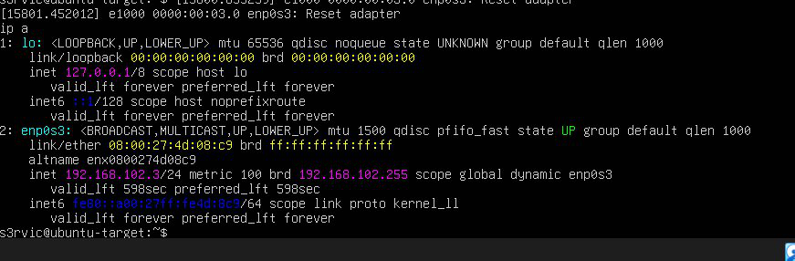

### Figure 2 — Kali Linux IP Address

*Screenshot: `ip a` output on Kali confirming `192.168.102.4` on `eth0` on the host-only network*

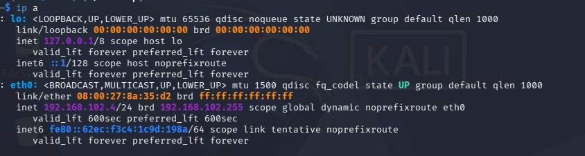

---

# 🔧 iptables Network Telemetry

## Why iptables and Not auth.log

The critical design challenge of this lab is that port scanning — especially a SYN scan — is **completely invisible to traditional application-level logs**. A SYN scan never completes a TCP handshake, so the target application never sees a completed connection and never logs anything. `/var/log/auth.log`, which was sufficient for the SSH brute force lab, is blind here.

The solution is to capture events at the **kernel networking layer** using iptables — before packets even reach any application. iptables processes every packet the kernel receives, regardless of whether the connection ever completes.

## Configuring the LOG Rule

An iptables rule was inserted at the **top** of Ubuntu’s INPUT chain to log every inbound packet:

```bash
sudo iptables -I INPUT -j LOG --log-prefix "IPTABLES: " --log-level 4
```

| Flag | Value | Purpose |
| --- | --- | --- |
| `-I INPUT` | — | Insert at the **top** of the INPUT chain (processes before any DROP rules) |
| `-j LOG` | — | Action: write a log entry rather than accept or drop |
| `--log-prefix` | `"IPTABLES: "` | Tags every log line for easy filtering in Splunk |
| `--log-level` | `4` | Warning level — keeps volume manageable |

Each log entry written to `/var/log/syslog` contains:

```jsx
IPTABLES: IN=enp0s3 OUT= MAC=... SRC=192.168.102.4 DST=192.168.102.3
PROTO=TCP SPT=42202 DPT=22 WINDOW=1024 RES=0x00 SYN URGP=0
```

## Making the Rule Persistent

iptables rules are held in memory and lost on reboot by default. Since no internet access was available to install `iptables-persistent`, persistence was achieved manually:

```bash
sudo mkdir -p /etc/iptables && sudo iptables-save | sudo tee /etc/iptables/rules.v4
```

A `@reboot` cron job was added to restore the rules on every boot:

```bash
sudo crontab -e
# Added:
@reboot iptables-restore < /etc/iptables/rules.v4
```

---

### Figure 3 — iptables LOG Rule Active

*Screenshot: `sudo iptables -L INPUT -n -v` confirming LOG rule at top of INPUT chain — `PROTO=all`, `level 4`, prefix `"IPTABLES: "`, 4 packets already counted*

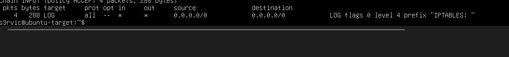

### Figure 4 — Network Events Flowing into syslog

*Screenshot: `tail -f /var/log/syslog | grep "IPTABLES"` showing live IPTABLES-prefixed entries with SRC, DST, PROTO, DPT fields populated after a test ping from Kali*

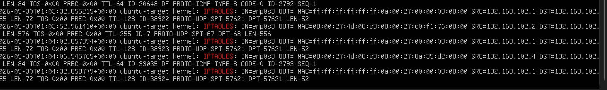

---

# 📡 Splunk Forwarder Configuration

The Splunk Universal Forwarder was already installed on Ubuntu from the previous lab. Its configuration was extended to monitor `/var/log/syslog` in addition to the existing `/var/log/auth.log`.

## inputs.conf — Extended

```jsx
[monitor:///var/log/auth.log]
index = main
sourcetype = linux_secure

[monitor:///var/log/syslog]
index = main
sourcetype = syslog
```

The `sourcetype = syslog` setting tells Splunk how to parse the file format, and critically, which field extraction rules to apply — enabling named fields like `SRC`, `DPT`, and `PROTO` to appear in search results.

## Permissions Fix

The forwarder runs as the `splunkfwd` service account, which had no read access to `/var/log/syslog` (permissions: `-rw-r-----`, group: `adm`). The fix was to add `splunkfwd` to the `adm` group:

```bash
sudo usermod -aG adm splunkfwd
sudo /opt/splunkforwarder/bin/splunk restart
```

This is permanent and survives log rotation, unlike a `chmod` which the syslog daemon would reset on each rotation.

## outputs.conf — Forwarding Destination

```jsx
[tcpout]
defaultGroup = default-autolb-group

[tcpout:default-autolb-group]
server = 192.168.102.1:9997
```

Splunk Enterprise on the Windows host was configured to receive on port `9997`, with a Windows Firewall inbound rule permitting TCP on that port.

---

### Figure 5 — Extended inputs.conf

*Screenshot: nano editor showing both monitor stanzas — auth.log with linux_secure and syslog with syslog sourcetype*

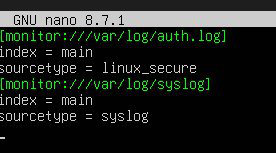

### Figure 6 — Splunk Receiving Port Configuration

*Screenshot: Splunk Settings → Forwarding and Receiving showing port 9997 enabled*

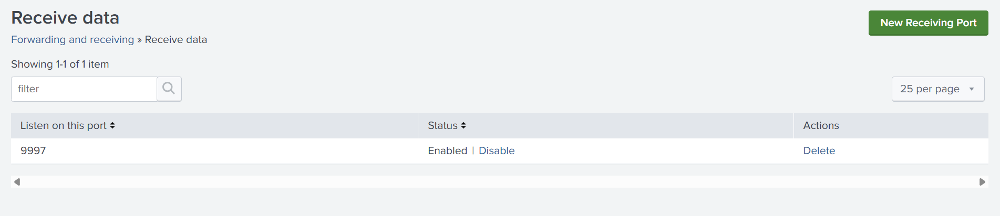

### Figure 7 — IPTABLES Events in Splunk

*Screenshot: Splunk Search & Reporting showing live IPTABLES events with `host=ubuntu-target`, `source=/var/log/syslog`, `sourcetype=syslog` confirmed*

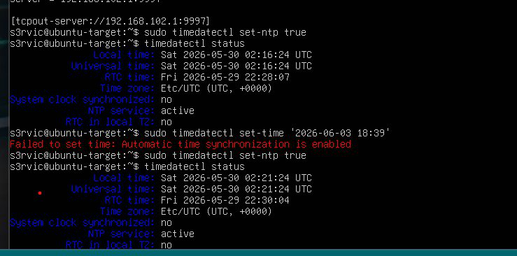

---

# ⚔️ Reconnaissance Simulation

Five distinct Nmap scan types were executed from Kali against Ubuntu. Each was chosen to represent a different attacker technique and to validate that the detection rule covers the full realistic threat landscape.

| Scan type | Command | Result | Duration |
| --- | --- | --- | --- |
| SYN scan (stealth) | `sudo nmap -sS 192.168.102.3` | 22/tcp open (SSH) | 0.19 seconds |
| Connect scan (full handshake) | `nmap -sT 192.168.102.3` | 22/tcp open (SSH) | 0.19 seconds |
| UDP scan | `sudo nmap -sU 192.168.102.3` | UDP services mapped | Several minutes |
| FIN scan (firewall evasion) | `sudo nmap -sF 192.168.102.3` | 999 ports open|filtered | ~2 seconds |
| Slow SYN scan | `sudo nmap -sS -T2 192.168.102.3` | 22/tcp open (SSH) | 401 seconds |

> Both Ubuntu and Kali confirmed **only port 22 (SSH)** was open across all TCP scans. This is the expected result for a default Ubuntu server with no additional services running.
> 
- 🔍 What each scan looks like in the logs
    
    **SYN scan:** Rapid burst of TCP packets, each with the `SYN` flag set and a different `DPT`. Events arrive microseconds apart. The connection is never completed — no `ACK` follows the `SYN-ACK`.
    
    **Connect scan:** Mix of `SYN` probes and many `ACK` packets from established connections. The same `DPT` repeats multiple times as both sides exchange acknowledgements during the handshake. Produces 5–6 packets per port vs. 2–3 for a SYN scan.
    
    **UDP scan:** Entries show `PROTO=UDP` with no TCP flags. `DPT` values vary slowly. No handshake-related traffic appears.
    
    **FIN scan:** TCP packets with `FIN URGP=0`. No SYN or ACK — abnormal flag combination that no legitimate application produces.
    
    **Slow scan:** Identical log format to the fast SYN scan. Only the timestamp gaps distinguish it — seconds between events rather than microseconds.
    

---

### Figure 8 — SYN Scan Results (Kali)

*Screenshot: Nmap output showing `22/tcp open ssh`, 999 closed ports, scan completed in 0.19 seconds*

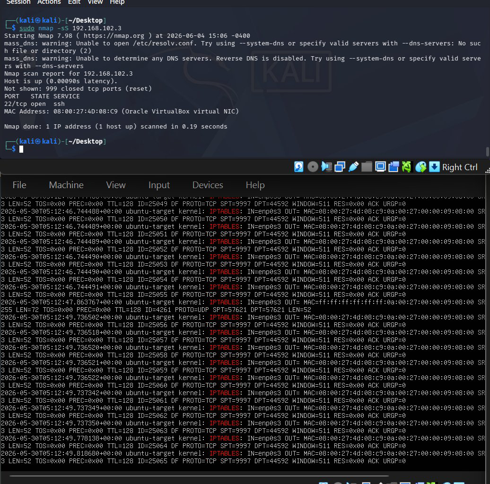

### Figure 9 — Connect Scan Results (Kali)

*Screenshot: Nmap `-sT` output showing `22/tcp open ssh`, 999 ports conn-refused, 0.19 seconds*

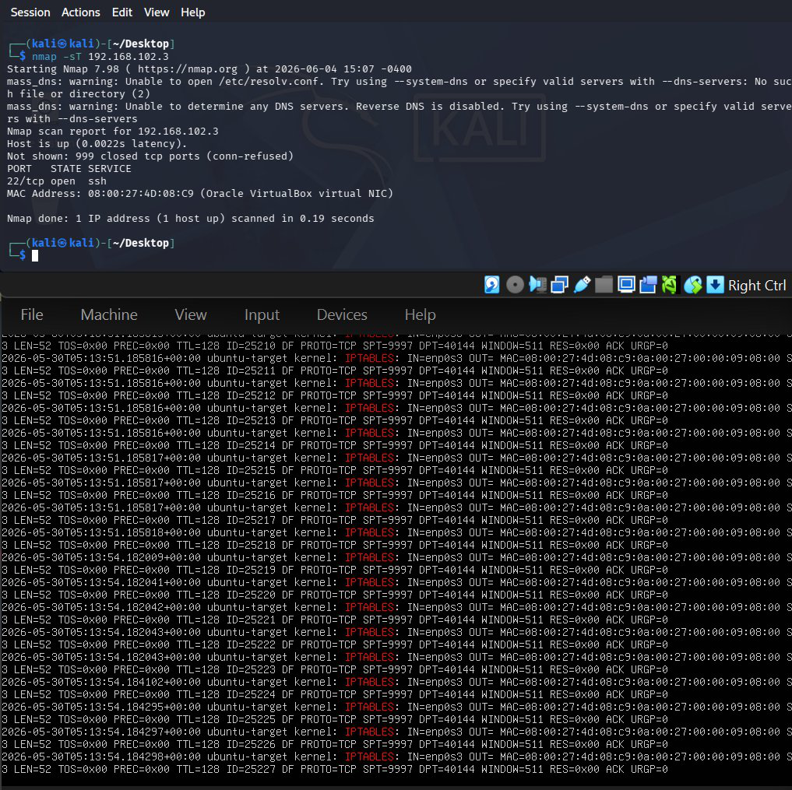

### Figure 10 — iptables Log During Active Scan

*Screenshot: Ubuntu syslog showing burst of IPTABLES entries with SRC=192.168.102.4 and rapidly varying DPT values during an active scan*

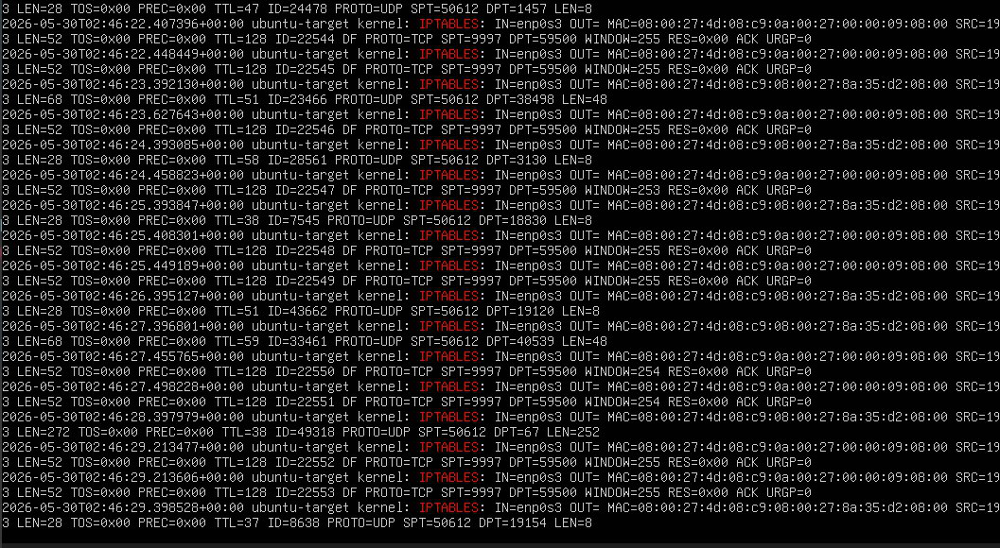

### Figure 11 — Slow Scan Completing (T2)

*Screenshot: Nmap `-sS -T2` output showing `22/tcp open ssh`, scan completed in 401.49 seconds*

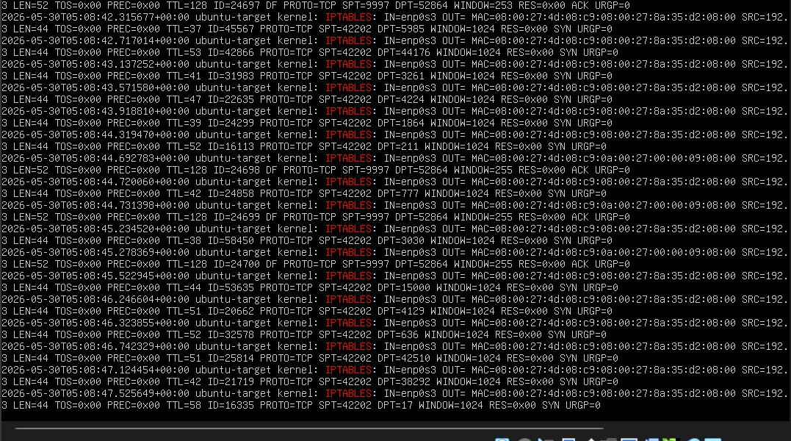

---

# 🔍 Field Discovery in Splunk

Before writing any detection logic, raw events were inspected in Splunk’s field extraction panel to confirm the exact field names extracted from the iptables log format.

**Key fields identified:**

| Field | Example value | Role in detection query |
| --- | --- | --- |
| `SRC` | `192.168.102.4` | Group by — identifies the scanning source |
| `DPT` | `22`, `80`, `443`... | `dc(DPT)` — counts distinct ports probed |
| `PROTO` | `TCP`, `UDP`, `ICMP` | Allows filtering by scan type |
| `DST` | `192.168.102.3` | Confirms direction (external → internal) |
| `IN` | `enp0s3` | Identifies the receiving network interface |

> Field names in Splunk are case-sensitive. `SRC` and `src_ip` are different fields — using the wrong name silently returns zero results with no error.
> 

---

### Figure 12 — Splunk Field Extraction Panel

*Screenshot: Splunk interesting fields panel showing SRC (5 values), DPT (100+), PROTO (3 values), DST (5 values) extracted from IPTABLES syslog events*

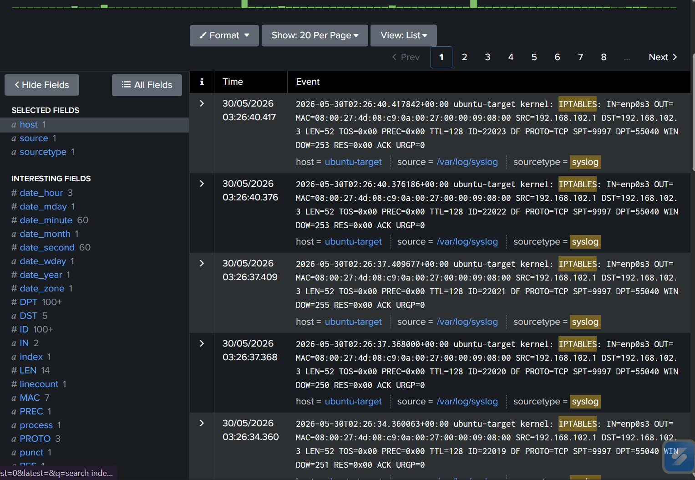

---

# 📊 Detection Query Development

## Why `dc(DPT)` and Not `count`

The detection logic must distinguish a scanner from a legitimately busy server. Raw `count` fails this:

| Source type | `count` | `dc(DPT)` |
| --- | --- | --- |
| Scanner probing 1000 ports once each | 1000 | 1000 |
| Busy server hit on port 443 by 1000 clients | 1000 | **1** |

Only `dc(DPT)` — the **distinct count** of unique destination port values — correctly separates a scanner from normal high-traffic behaviour.

## Initial Query

```
index=main sourcetype=syslog IPTABLES
| stats dc(DPT) as unique_ports by SRC
| where unique_ports > 15
```

**Results before tuning:**

| SRC | unique_ports | Verdict |
| --- | --- | --- |
| `192.168.102.4` (Kali) | 1811 | 🔴 SCANNER — confirmed attacker |
| `192.168.102.1` (Windows host) | 178 | 🟡 FALSE POSITIVE — background OS traffic |
| `127.0.0.53` (Ubuntu DNS resolver) | 80 | 🟡 FALSE POSITIVE — internal loopback traffic |

> 1811 unique ports from a single IP is unambiguous. No legitimate application probes nearly 2000 distinct ports. The scanner is immediately identifiable, but two false positives must be addressed before the rule is production-ready.
> 

---

### Figure 13 — Initial Detection Query Results

*Screenshot: Splunk statistics table showing 3 rows — 192.168.102.4 (1811), 192.168.102.1 (178), 127.0.0.53 (80)*

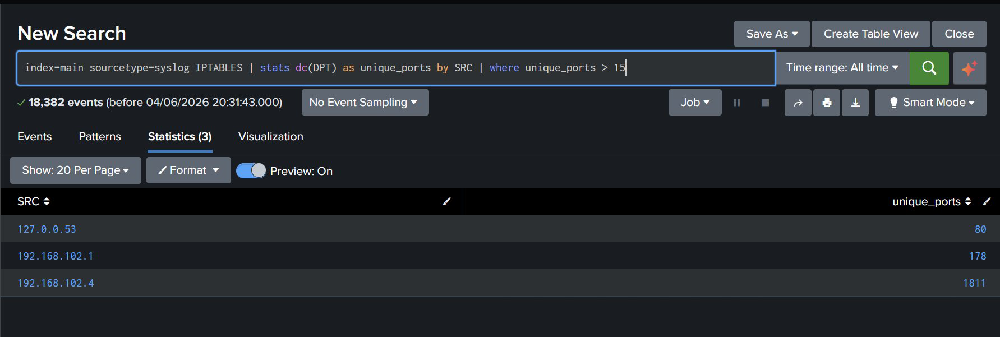

---

# 🎯 Threshold Tuning & False Positive Reduction

## Threshold Selection

A threshold of **300 unique ports** was selected based on the observed data gap:

| Source | Unique ports | Classification |
| --- | --- | --- |
| 127.0.0.53 (DNS resolver) | 80 | Highest false positive — loopback |
| 192.168.102.1 (Windows host) | 178 | Highest false positive — LAN source |
| **Threshold set at** | **300** | Clear margin above all legitimate sources |
| 192.168.102.4 (Kali scanner) | 1811 | 🔴 Real scanner — detected with large margin |

## False Positive Exclusions

Two exclusions were added to the `where` clause using Splunk’s `match()` regex function:

```
index=main sourcetype=syslog IPTABLES
| stats dc(DPT) as unique_ports by SRC
| where unique_ports > 300
    AND NOT match(SRC, "^127\.")
    AND SRC!="192.168.102.1"
```

| Exclusion | Method | Reason for choice |
| --- | --- | --- |
| Loopback range (127.x.x.x) | `NOT match(SRC, "^127\.")` — regex | Covers all `127.x.x.x` addresses, not just `127.0.0.53` |
| Windows host (192.168.102.1) | `SRC!="192.168.102.1"` — direct match | Single known IP, regex would be unnecessary complexity |

**Final result:** Only `192.168.102.4` (Kali) returned, with **1811 unique ports** — zero false positives.

---

### Figure 14 — Tuned Query Results

*Screenshot: Splunk statistics table showing a single row — 192.168.102.4 with 1811 unique_ports — after exclusions applied*

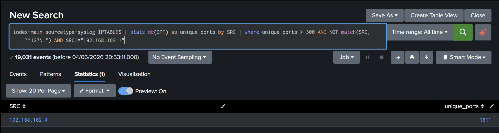

---

# 🔔 Alert Configuration

The tuned detection query was saved as a Splunk scheduled alert to enable autonomous detection without analyst intervention.

**Alert settings:**

| Setting | Value | Rationale |
| --- | --- | --- |
| Alert type | Scheduled | Runs on a fixed timer rather than per-event |
| Schedule | Every 5 minutes | Timely detection — Nmap can complete in under a second |
| Time range | All time | Required due to clock skew between Ubuntu and Windows host |
| Trigger condition | Number of results > 0 | Alert immediately if any source clears the threshold |
| Throttle | 60 minutes | Prevents repeat alerts every 5 minutes for the same ongoing scan |
| Action | Log Event | Records alert in Splunk’s own index for verification |

**Log Event message:**

```jsx
Port scan detected. Source IP $result.SRC$ touched $result.unique_ports$ unique ports.
```

The `$result.SRC$` and `$result.unique_ports$` tokens are replaced by the actual field values when the alert fires, giving an analyst the specific IP and port count immediately.

## MITRE ATT&CK Mapping

| Field | Value |
| --- | --- |
| **Tactic** | Reconnaissance (TA0043) |
| **Technique** | T1046 — Network Service Discovery |
| **Description** | Adversaries may attempt to get a listing of services running on remote hosts and local network infrastructure devices, including those running on various protocols, in order to identify attack targets |

> T1046 is one of the most consistently observed pre-intrusion techniques across real-world incident reports. Detecting it early — before exploitation begins — is the purpose of this entire lab.
> 

---

### Figure 15 — Save As Alert Dialog

*Screenshot: Splunk Save As Alert form showing title “Port Scan Detection”, description, schedule every 5 minutes, trigger when results > 0*

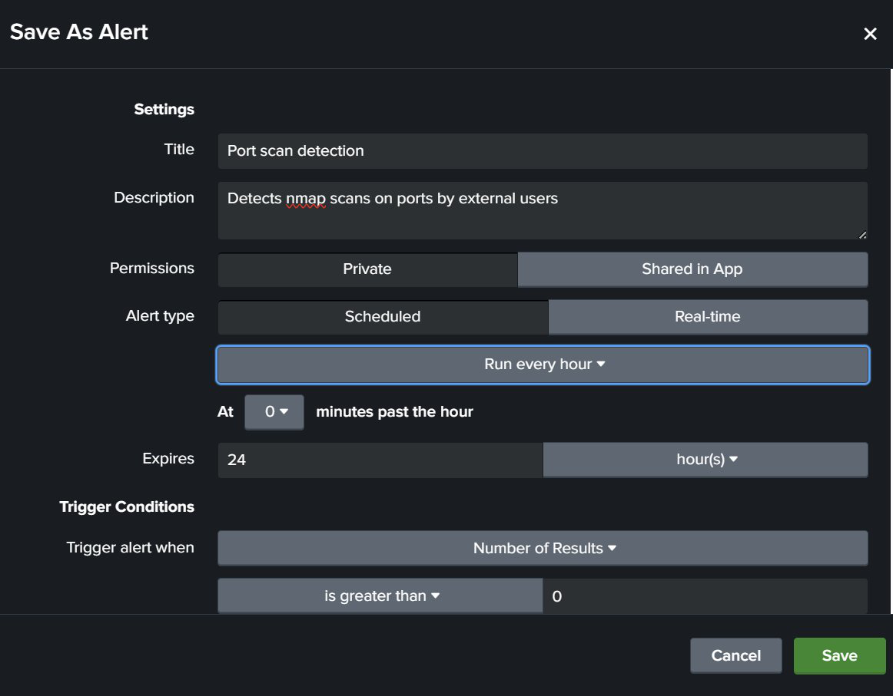

### Figure 16 — Log Event Configuration

*Screenshot: Log Event action block showing event message with `$result.SRC$` token, sourcetype stash, host ubuntu-target, index main*

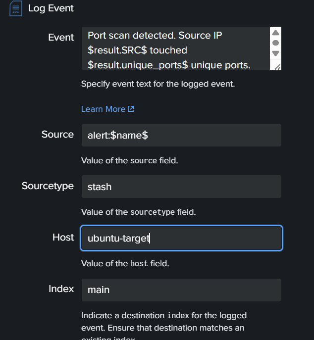

### Figure 17 — Active Alerts List

*Screenshot: Splunk Alerts page showing two enabled alerts — Port Scan Detection and SSH Brute Force Detected — Status: Enabled*

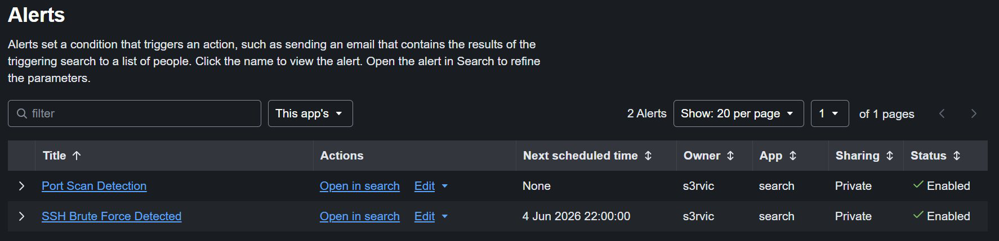

---

# ✅ Summary

## Key Findings

| Finding | Detail |
| --- | --- |
| 🔴 Reconnaissance confirmed | Kali (`192.168.102.4`) probed **1811 distinct ports** across all scan types |
| 🔴 All scan types captured | SYN, Connect, UDP, FIN, and slow T2 scans all appeared in iptables logs |
| 🟡 Two false positives resolved | Windows host (178 ports) and Ubuntu DNS resolver (80 ports) excluded by rule |
| ✅ Pipeline verified end-to-end | iptables → syslog → Forwarder → Splunk Enterprise all functioning correctly |
| ✅ Detection query working | `dc(DPT) > 300` correctly identified Kali with zero false positives |
| ✅ Alert configured | Scheduled every 5 minutes, throttled at 60 minutes, Log Event action set |

---
