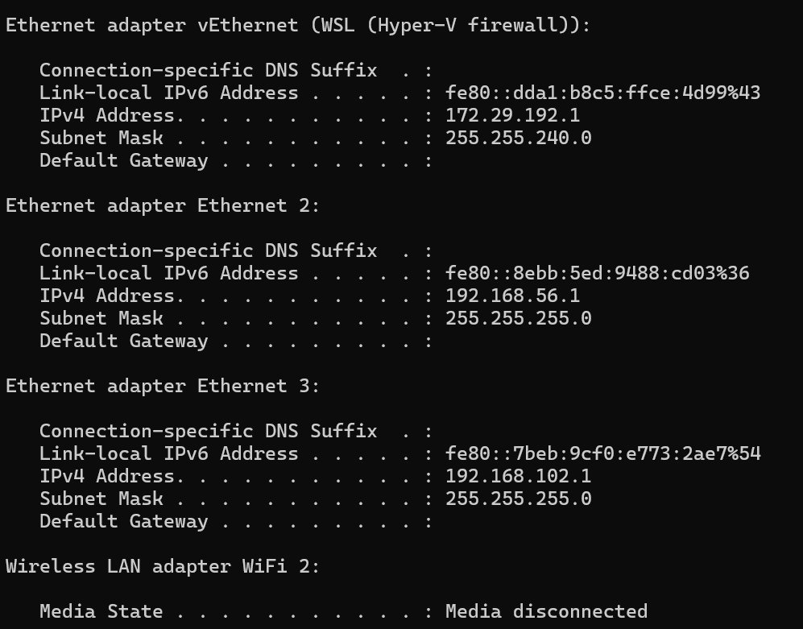

# 📝 SSH Brute Force Detection — Project Write-up

> **Project:** SSH Brute Force Detection & Splunk SIEM Dashboard
> 

> **Course:** MSci Cyber Security — Lab Project
> 

> **Tools:** VirtualBox · Kali Linux · Ubuntu Server · Hydra · Splunk Enterprise · rockyou.txt
> 

> 📖 **Read alongside:** [🔐 Fundamentals] for theory
> 

---

# 🗺️ Lab Environment

## Network Architecture

The lab runs entirely on a single Windows host using VirtualBox. A host-only network (`192.168.102.x`) isolates all attack traffic within the machine — no traffic reaches the real home network at any point.

| Machine | Role | IP Address |
| --- | --- | --- |
| **Windows Host** | Runs Splunk Enterprise · gateway for host-only network | `192.168.102.1` |
| **Kali Linux VM** | Attacker · runs Hydra dictionary attack | `192.168.102.4` |
| **Ubuntu Server VM** | Victim · intentionally vulnerable SSH target | `192.168.102.3` |

```
Kali Linux  (192.168.102.4)
  └── Hydra runs dictionary attack
        └──▶ hammers SSH on Ubuntu port 22

Ubuntu Server  (192.168.102.3)
  └── SSH receives attempts → writes to /var/log/auth.log
        └──▶ Splunk Forwarder ships logs to Windows:9997

Windows Host  (192.168.102.1)
  └── Splunk indexes logs → SPL queries detect patterns
        └──▶ Dashboard visualises attack · Alert fires on threshold
```

> The host-only network is critical for ethical containment. No attack traffic leaves the laptop. Running Hydra on a bridged network would put brute force traffic onto your real home network — potentially flagged by your ISP and a violation of the Computer Misuse Act 1990.
> 

---

### Figure 1 — Windows Host Network Configuration

*Screenshot: `ipconfig` output confirming VirtualBox Host-Only Ethernet Adapter at `192.168.102.1`*

> 
> 
> 
> 
> 

### Figure 2 — Kali Linux IP Address

*Screenshot: `ip a` output on Kali confirming `192.168.102.4` on the host-only network*


### Figure 3 — Ubuntu Target IP Address

*Screenshot: `ip a` output on Ubuntu confirming `192.168.102.3` on the host-only network*


### Figure 4 — Network Connectivity Verification

*Screenshot: `ping 192.168.102.3` from Kali showing 0% packet loss*


> Zero packet loss confirms the isolated lab network is functioning correctly. This is a required verification step before any attack simulation — if VMs can’t reach each other, Hydra will silently fail.
> 

---

# 🔍 Splunk SIEM Configuration

Splunk Enterprise was installed on the Windows host and accessed at `http://localhost:8000`. The Splunk Universal Forwarder was installed on the Ubuntu VM to ship `/var/log/auth.log` entries to Splunk in real time.

## Forwarder Configuration

The forwarder was configured via two files on Ubuntu:

**`inputs.conf`** — tells the forwarder which file to monitor:

```
[monitor:///var/log/auth.log]
index = main
sourcetype = linux_secure
```

**`outputs.conf`** — tells the forwarder where to send the data:

```
[tcpout]
defaultGroup = default-autolb-group

[tcpout:default-autolb-group]
server = 192.168.102.1:9997
```

- 📋 Why these two files specifically?
    
    `inputs.conf` defines the **data source** — which file to watch and how to categorise it in Splunk.
    
    `outputs.conf` defines the **destination** — which IP and port to ship the data to. Port `9997` is Splunk’s default receiver port.
    
    Without `inputs.conf`, the forwarder runs but sends nothing. Without `outputs.conf`, the forwarder has no address to ship to. Both are required.
    

## Receiving Port & Firewall Rule

Splunk was configured to receive data on port `9997`, and a Windows Firewall inbound rule was created to allow traffic on this port from Ubuntu only.

| Configuration | Location | Setting |
| --- | --- | --- |
| Splunk receiving port | Settings → Forwarding and receiving | Port `9997` — Enabled |
| Windows Firewall rule | Inbound Rules → Splunk-9997 | TCP `9997` — source scoped to `192.168.102.3` only |

> Scoping the firewall rule to Ubuntu’s IP (`192.168.102.3`) is **defence in depth** — even if another device somehow reached the host-only network, it could not send data to Splunk on port 9997. Only the Ubuntu VM can.
> 

---

### Figure 5 — Splunk Enterprise Dashboard

*Screenshot: Splunk home dashboard confirming successful installation and login*


### Figure 6 — Forwarder Configuration Files

*Screenshot: `inputs.conf` and `outputs.conf` content on Ubuntu terminal*


### Figure 7 — Splunk Receiving Port

*Screenshot: Splunk Settings showing port 9997 enabled and active*


## Log Pipeline Verification

Before running the attack, two checks confirmed the pipeline was working end-to-end:

**On Ubuntu — auth.log recording SSH events:**

```bash
sudo tail -20 /var/log/auth.log
```

**In Splunk — events flowing from Ubuntu:**

```
index=main sourcetype=linux_secure
```

Result confirmed: `host = ubuntu-target` · `source = /var/log/auth.log` · `sourcetype = linux_secure` ✓

### Figure 8 — Ubuntu auth.log Events

*Screenshot: `tail -20 /var/log/auth.log` showing Failed password and Accepted password entries*


### Figure 9 — Splunk Receiving Logs

*Screenshot: Splunk Search & Reporting showing live events from ubuntu-target via /var/log/auth.log*


---

# ⚔️ Brute Force Attack Simulation

Hydra was run from the Kali VM to simulate a dictionary-based SSH brute force attack against the Ubuntu target. The `rockyou.txt` wordlist (14 million real-world leaked passwords) was used.

> The target account used password `password1` — a password that appears near the **top** of rockyou.txt. This was intentional: a password buried deep in the list would run for hours. Choosing a top-ranked password guarantees a fast, clean result with clear evidence for Splunk. Originally Password123 was used, however it was too deep in the text file and so it was changed.
> 

**Hydra command:**

```bash
hydra -l s3rvic -P /usr/share/wordlists/rockyou.txt -t 2 -W 3 -V ssh://192.168.102.3
```

| Flag | Value | Purpose |
| --- | --- | --- |
| `-l` | `s3rvic` | Username to attack |
| `-P` | `rockyou.txt` | Password wordlist |
| `-t` | `2` | 2 threads (reduced from 4 to avoid SSH connection throttling) |
| `-W` | `3` | 3 second wait between attempts |
| `-V` | — | Verbose — shows every attempt in real time |
| `ssh://` | `192.168.102.3` | Target protocol and IP |

**Attack result:**

```
[22][ssh] host: 192.168.102.3   login: s3rvic   password: password1
1 of 1 target successfully completed, 1 valid password found
```

> Password cracked in **28 attempts**. The full attack generated **407 failed authentication attempts** in auth.log — providing rich detection data for Splunk analysis.
> 

### Figure 10 — Hydra Attack Output

*Screenshot: Hydra terminal showing password1 found after 28 attempts, 1 of 1 targets completed*


---

# 📊 Detection & Analysis in Splunk

## Failed Login Count by Source IP

```
index=main sourcetype=linux_secure "Failed password"
| rex field=_raw "from (?P<src_ip>\d+\.\d+\.\d+\.\d+)"
| stats count as failed_attempts by src_ip
| sort -failed_attempts
```

**Result:**

| src_ip | failed_attempts | Classification |
| --- | --- | --- |
| `192.168.102.4` | 407 | 🔴 CRITICAL — Kali (attacker) |
| `192.168.102.3` | 3 | 🟡 LOW — Ubuntu (normal activity) |

> 407 failures from a single IP in a short window is unambiguous. A real user does not fail 400 times. This single query is the core of the detection logic.
> 

### Figure 11 — SPL Query Results

*Screenshot: Splunk table showing 407 failed attempts from 192.168.102.4, classified as CRITICAL*


## Successful Login Evidence

```
index=main sourcetype=linux_secure "Accepted password"
```

**Result:** `Accepted password for s3rvic from 192.168.102.4 port 49318 ssh2`

> **This is the highest severity finding.** The same IP that generated 407 failures successfully authenticated. This combination — mass failures followed by success from the same source — is definitive evidence of a completed brute force attack.
> 

### Figure 12 — Successful Login Event

*Screenshot: Splunk showing Accepted password for s3rvic from 192.168.102.4 — confirming attack succeeded*


---

# 📡 Splunk Detection Dashboard

A custom dashboard titled **SSH Brute Force Detection** was built with four complementary panels. Each panel answers a different question a SOC analyst would ask during an investigation.

| Panel | Question answered | Visualisation |
| --- | --- | --- |
| Failed attempts by IP | *Who is attacking?* | Bar chart |
| SSH failures over time | *When did the attack happen?* | Line chart |
| Top attacking IPs + threat level | *How serious is each attacker?* | Statistics table |
| Successful logins from attacking IPs | *Did the attack succeed?* | Statistics table |

## Panel 1 — Failed Attempts by Source IP

```
index=main sourcetype=linux_secure "Failed password"
| rex field=_raw "from (?P<src_ip>\d+\.\d+\.\d+\.\d+)"
| stats count as failed_attempts by src_ip
| sort -failed_attempts
```

`192.168.102.4` towers over all other IPs with 400+ failures — the attacker is immediately identifiable at a glance.

### Figure 13 — Panel 1: Bar Chart

*Screenshot: Bar chart with 192.168.102.4 dominating the chart with 400+ failed attempts*


---

## Panel 2 — SSH Failures Over Time

```
index=main sourcetype=linux_secure "Failed password"
| rex field=_raw "from (?P<src_ip>\d+\.\d+\.\d+\.\d+)"
| timechart count as failed_attempts by src_ip
```

The timeline shows a clear spike at the exact time Hydra was running (30 May 2026, ~00:30). This temporal view is critical for incident response — it tells an analyst when the attack started and ended, and whether it was a one-time event or an ongoing campaign.

### Figure 14 — Panel 2: Attack Timeline

*Screenshot: Line chart showing the brute force spike on 30 May 2026 at approximately 00:30*


---

## Panel 3 — Top Attacking IPs with Threat Level

```
index=main sourcetype=linux_secure "Failed password"
| rex field=_raw "from (?P<src_ip>\d+\.\d+\.\d+\.\d+)"
| stats count as failed_attempts dc(src_ip) as unique_ips by src_ip
| sort -failed_attempts
| eval threat_level=if(failed_attempts>100,"CRITICAL",if(failed_attempts>20,"HIGH","LOW"))
```

**Threat classification logic:**

| Threshold | Label | Rationale |
| --- | --- | --- |
| > 100 failures | 🔴 CRITICAL | Volume far exceeds any legitimate scenario |
| > 20 failures | 🟠 HIGH | Likely automated or persistent attacker |
| ≤ 20 failures | 🟡 LOW | Could be a mistyped password |

This automated triage means an analyst sees severity labels instantly — no manual counting required.

### Figure 15 — Panel 3: Threat Level Table

*Screenshot: Statistics table showing 192.168.102.4 — 407 attempts — CRITICAL*


---

## Panel 4 — Successful Logins from Attacking IPs

```
index=main sourcetype=linux_secure "Accepted password"
| rex field=_raw "for (?P<username>\w+) from (?P<src_ip>\d+\.\d+\.\d+\.\d+)"
| stats count as successful_logins values(username) as username by src_ip
| eval status="POSSIBLE BREACH - INVESTIGATE IMMEDIATELY"
```

This panel flags any IP that achieved a successful login. When that IP also appears in the failures panel, the conclusion is unambiguous: the brute force attack worked.

### Figure 16 — Panel 4: Possible Breach

*Screenshot: Table showing 192.168.102.4 — 2 successful logins — s3rvic — POSSIBLE BREACH - INVESTIGATE IMMEDIATELY*


---

# 🔔 Threshold-Based Alert

A Splunk saved search alert was configured to automatically detect brute force activity without analyst intervention.

**Detection query:**

```
index=main sourcetype=linux_secure "Failed password"
| rex field=_raw "from (?P<src_ip>\d+\.\d+\.\d+\.\d+)"
| stats count as failed_attempts by src_ip
| where failed_attempts > 10
```

**Alert configuration:**

| Setting | Value |
| --- | --- |
| Alert type | Scheduled |
| Frequency | Every 1 hour |
| Trigger condition | Number of results > 0 |
| Trigger mode | Once per run |
| Severity | Critical |
| Log event | `SSH Brute Force attack detected - Multiple failed login attempts from $result.src_ip$` |

> The **1 hour minimum** is a limitation of the free Splunk licence (500MB/day). In a production SOC environment with a paid licence, this would be set to every **1–5 minutes** for near real-time detection.
> 

## MITRE ATT&CK Mapping

| Field | Value |
| --- | --- |
| **Tactic** | Initial Access / Credential Access |
| **Technique** | T1110 — Brute Force |
| **Sub-technique** | T1110.001 — Password Guessing |

> T1110.001 is one of the most commonly observed techniques in real-world incident reports.
> 

### Figure 17 — Alert Configuration

*Screenshot: Splunk alert settings — scheduled hourly, triggers when failed attempts exceed threshold, severity Critical*


---

# ✅ Summary

## Key Findings

| Finding | Detail |
| --- | --- |
| 🔴 Password cracked | `password1` found in **28 attempts** using rockyou.txt |
| 🔴 Attack volume | **407 failed SSH attempts** logged in auth.log |
| 🔴 Successful breach | Kali (`192.168.102.4`) achieved a confirmed login as `s3rvic` |
| ✅ Pipeline verified | Forwarder → Indexer → Search Head all functioning correctly |
| ✅ Detection working | SPL queries correctly identified attacker IP as CRITICAL |
| ✅ Dashboard built | 4 panels providing complete attack visibility |
| ✅ Alert configured | Threshold-based alert fires within 1 hour of attack beginning |

## Production Improvements

- 📋 What would change in a real environment?
    - **Disable SSH password authentication** — use key-based auth only. This makes brute force attacks mathematically infeasible.
    - **Deploy fail2ban** — automatically bans IPs after a configurable number of failures. Would have stopped Hydra before it generated meaningful data.
    - **Reduce alert scheduling to 1–5 minutes** — requires a paid Splunk licence but enables near real-time detection.
    - **Integrate with a ticketing system** — auto-create an incident in ServiceNow or Jira when the alert fires, rather than relying on an analyst noticing the triggered alert.
    - **Use static IPs for VMs** — in production, server IPs should never change. DHCP is acceptable for a lab but not for a real target machine.
    - **Geo-map source IPs** — in a real environment, Splunk’s geographic lookup would plot attacker IPs on a world map. A login attempt from an unexpected country is an immediate red flag.

---
